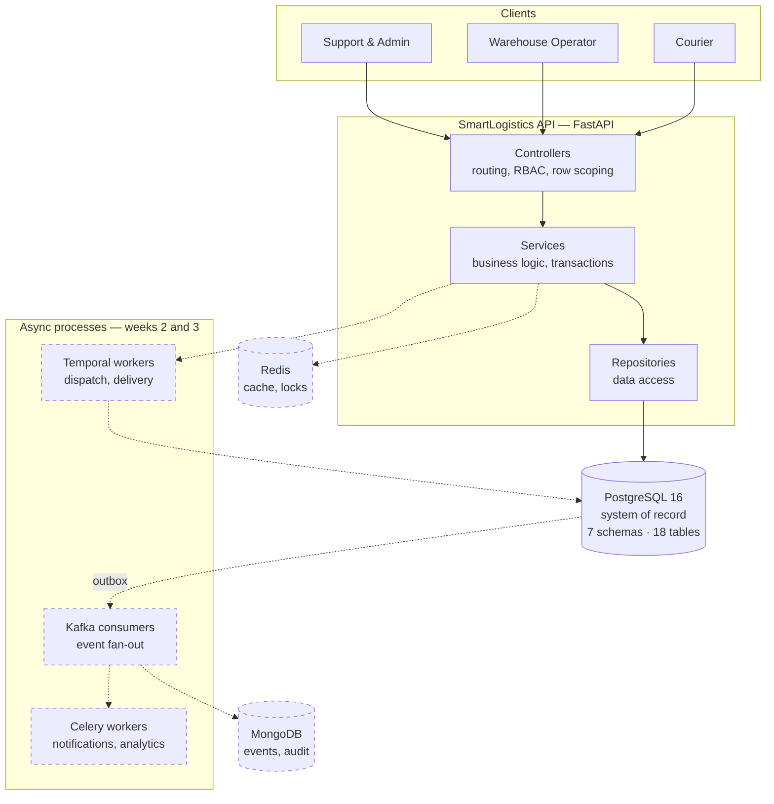

# SmartLogistics — Backend

Intelligent Supply Chain & Delivery Orchestration Platform for TransFleet.

A logistics backend covering the shipment lifecycle: warehouse and inventory operations,
dispatch orchestration, courier assignment, tracking, returns and analytics — followed by
a GenAI layer for operational insights.

> **Status: Week 1 of 5** — foundation, data model and core services.
> The tree contains only what is currently built. See
> [`docs/ARCHITECTURE.md` §16.2](docs/ARCHITECTURE.md) for folders added in later weeks.

---

## Architecture

Solid lines are built and running today; dashed lines are designed and scheduled for later weeks
([ARCHITECTURE.md §1.1](docs/ARCHITECTURE.md) has the week-by-week mapping).



The API is a **modular monolith with process-type separation**: one codebase and one image, with
separate entrypoints for the API, workflow workers and consumers, so background load can never
starve request handling. [ADR-001](docs/ARCHITECTURE.md) explains why this rather than microservices.

---

## Tech stack

| Layer | Technology |
|---|---|
| API | Python 3.12+, FastAPI, Pydantic v2 |
| Database | PostgreSQL 16 (system of record), SQLAlchemy 2.0 async, Alembic |
| Event store | MongoDB (tracking events, audit trail) |
| Cache / locks | Redis |
| Orchestration *(week 2)* | Temporal |
| Events *(week 3)* | Kafka + Schema Registry, Celery + RabbitMQ |
| Observability *(week 3)* | OpenTelemetry, Prometheus, Grafana, Jaeger |
| GenAI *(weeks 4–5)* | LangGraph, vector database, LLM provider |
| Tooling | uv, Ruff, pytest |
| Packaging | Docker (multi-stage), Docker Compose, Kubernetes via Kustomize |

---

## Quick start with Docker

The whole stack in one command — no Python, Postgres or Redis needed on your machine:

```bash
make docker-up      # Postgres, Redis, migrations, API on :8000
make docker-seed    # development data
```

Open <http://localhost:8000/docs> and log in as `admin@transfleet.com` / `SmartLogistics!2026`.
`make docker-down` stops it; add `v=1` to delete the data volumes.

Postgres is published on **5433** and Redis on **6380** so the stack runs alongside any you already
have on the usual ports. Full detail, plus Kubernetes for AWS and Azure, is in
[deploy/README.md](deploy/README.md).

To run everything natively instead, carry on below.

---

## Prerequisites

*(Only for running without Docker.)*

- Python 3.12 or newer
- PostgreSQL 16 running locally
- MongoDB running locally
- Redis running locally
- [uv](https://docs.astral.sh/uv/) — `pip install uv`

### macOS setup

```bash
brew install postgresql@16 mongodb-community redis
brew services start postgresql@16
brew services start mongodb-community
brew services start redis

# postgresql@16 is keg-only — put its client tools on PATH
echo 'export PATH="/opt/homebrew/opt/postgresql@16/bin:$PATH"' >> ~/.zshrc
```

If `brew services start postgresql@16` fails with `Bootstrap failed: 5: Input/output error`,
the data directory was never initialised:

```bash
brew services stop postgresql@16
initdb --locale=C -E UTF-8 /opt/homebrew/var/postgresql@16
brew services start postgresql@16
```

---

## Setup

```bash
# 1. clone and enter the project
git clone git@github.com:Abdullah18x/smart_logistics.git
cd smart_logistics

# 2. create the database
createdb smartlogistics

# 3. install dependencies into a virtual environment
uv venv
uv pip install -e ".[dev]"

# 4. configure the environment
cp .env.example .env
#    then edit DATABASE_URL and MONGO_URI to match your machine

# 5. create the tables
.venv/bin/alembic upgrade head

# 6. load development data
.venv/bin/python -m app.seeders.runner
```

Activate the environment with `source .venv/bin/activate` to drop the `.venv/bin/` prefix
from every command below.

---

## Running

```bash
uvicorn app.main:app --reload --port 8000
```

| URL | Purpose |
|---|---|
| http://localhost:8000/docs | Swagger UI — click **Authorize** to paste an access token |
| http://localhost:8000/redoc | ReDoc |
| http://localhost:8000/health | Liveness |
| http://localhost:8000/health/ready | Readiness — checks PostgreSQL |

### Trying it out

```bash
curl -X POST http://localhost:8000/api/v1/auth/login \
  -H 'Content-Type: application/json' \
  -d '{"email":"admin@transfleet.com","password":"SmartLogistics!2026"}'
```

Use the returned `access_token` as `Authorization: Bearer <token>`.

### Endpoints

| Method | Path | Access |
|---|---|---|
| POST | `/api/v1/auth/login` | public |
| POST | `/api/v1/auth/refresh` | public (rotates the token) |
| POST | `/api/v1/auth/logout` | authenticated |
| GET | `/api/v1/auth/sessions` | authenticated |
| GET | `/api/v1/auth/me` | authenticated |
| POST | `/api/v1/users` | admin |
| GET | `/api/v1/users` | admin — filter by `role`, `status`, `search` |
| GET | `/api/v1/users/{id}` | admin |
| PATCH | `/api/v1/users/me` | authenticated |
| POST | `/api/v1/users/me/password` | authenticated |
| PATCH | `/api/v1/users/{id}` | admin |
| PATCH | `/api/v1/users/{id}/role` | admin |
| PATCH | `/api/v1/users/{id}/status` | admin |
| DELETE | `/api/v1/users/{id}` | admin (soft delete) |

**Security behaviour**

- Access tokens last 15 minutes; refresh tokens 14 days and **rotate on every use**
- Replaying a rotated refresh token revokes every session for that user
- 5 failed logins lock the account for 15 minutes
- Changing a password, or suspending an account, revokes all its sessions
- Admins cannot change their own role or status, or delete themselves

---

## Development data

`python -m app.seeders.runner` creates 11 accounts, all sharing the password in
`SEED_DEFAULT_PASSWORD` (`SmartLogistics!2026` by default).

| Email | Role |
|---|---|
| `admin@transfleet.com` | admin |
| `support.lead@transfleet.com` | customer_support |
| `support.agent@transfleet.com` | customer_support |
| `wh.karachi@transfleet.com` | warehouse_operator — KHI-01 |
| `wh.lahore@transfleet.com` | warehouse_operator — LHE-01 |
| `wh.regional@transfleet.com` | warehouse_operator — KHI-01, LHE-01, ISB-01 |
| `courier.one@transfleet.com` … `courier.four@transfleet.com` | courier |
| `courier.suspended@transfleet.com` | courier (suspended, for status testing) |

Seeders are idempotent — re-running creates nothing new — and refuse to run when
`ENVIRONMENT=production`.

```bash
python -m app.seeders.runner              # everything
python -m app.seeders.runner --only users # one seeder
```

---

## Database migrations

```bash
alembic upgrade head                          # apply everything
alembic revision --autogenerate -m "message"  # generate from model changes
alembic downgrade -1                          # roll back one revision
alembic current                               # show applied revision
```

Autogenerate does not emit `CREATE SCHEMA`. When a migration introduces a new module
schema, add `op.execute("CREATE SCHEMA IF NOT EXISTS <name>")` at the top of `upgrade()`
and register the schema in `VERSIONED_SCHEMAS` in `migrations/env.py`.

---

## Everyday commands

`make help` lists everything. The common ones:

| Command | What it does |
|---|---|
| `make install` | Create the venv and install dependencies |
| `make run` | Start the API with reload on :8000 |
| `make routes` | Print every registered route |
| `make migrate` | Apply migrations |
| `make migration m="add shipments"` | Generate a migration from model changes |
| `make seed` | Load development data |
| `make reset` | Drop, re-migrate and re-seed |
| `make api` | Regenerate `docs/curl/` — run after any route change |
| `make check` | Lint, format check and migration drift check |
| `make test` | Run the whole test suite |
| `make test-unit` | Unit tests only — no database needed |
| `make test-integration` | Services and repositories against Postgres |
| `make test-e2e` | HTTP tests through the running app |
| `make test-fast` | Skip the tests that open extra database connections |
| `make coverage` | Test suite plus a coverage report |
| `make docker-up` / `docker-down` | Start / stop the whole stack in containers |
| `make docker-seed` | Load development data into the containerised database |
| `make docker-test` | Run the test suite inside a container |
| `make docker-build` | Build the production image |
| `make k8s-build CLOUD=aws` | Render the Kubernetes manifests without applying |
| `make k8s-deploy CLOUD=aws` | Apply them (`CLOUD=azure` for AKS) |
| `make k8s-migrate CLOUD=aws` | Run the migration Job and wait for it |

## Automated tests

701 tests across three layers, at 92% line coverage.

```bash
make test
```

They run against **real PostgreSQL**, not SQLite — the code depends on generated columns, native
enums, schema-qualified tables, sequences and row locking. The suite drops and rebuilds a separate
`smartlogistics_test` database by running the migrations from empty, so your development data is
never touched. Nothing else needs setting up: point `DATABASE_URL` at a running Postgres and the
suite creates what it needs.

| Layer | Tests | Database |
|---|---|---|
| `tests/unit` | 257 | No — runs anywhere, in under a second |
| `tests/integration` | 289 | Yes |
| `tests/e2e` | 139 | Yes |

Each test runs inside a transaction that is rolled back afterwards, so tests never interfere with
one another. The concurrency tests in `tests/integration/test_concurrency.py` are the exception —
row locking only exists between real connections — and are marked `slow`.

See [phase_1.md §10b](docs/phase_1.md) for what the suite covers and why.

## Manual testing — Postman / curl

The [`docs/curl/`](docs/curl/) folder is generated from the live routes, so it never drifts:

```bash
make api
```

**Browser:** open [`docs/curl/index.html`](docs/curl/index.html) — every endpoint with a
copy-ready curl command, live variable substitution for base URL, token and path parameters,
and a copy button that pastes straight into Postman's **Import → Raw text**.

**Postman:** import `docs/curl/SmartLogistics.postman_collection.json` and
`docs/curl/SmartLogistics.postman_environment.json`, select the **SmartLogistics — Local**
environment, then run the login request — it stores the tokens automatically, so every
other request is authorised.

**Shell:**

```bash
source docs/curl/env.sh     # logs in, exports BASE_URL and ACCESS_TOKEN
curl -s "$BASE_URL/api/v1/users" -H "Authorization: Bearer $ACCESS_TOKEN" | jq
```

See [docs/curl/README.md](docs/curl/README.md) for details.

---

## Project structure

```
Dockerfile          multi-stage; the runtime target is non-root
docker-compose.yml  Postgres, Redis, migrations, API
src/app/
  controllers/      HTTP routes, dependencies, RBAC gates
  services/         business logic, transaction boundaries
  repositories/     database access
  models/           SQLAlchemy models — one file per entity
  schemas/          Pydantic request/response contracts
  seeders/          development data — one seeder per entity
  core/             config, database, security, enums, exceptions
  main.py           application factory
migrations/         Alembic — 9 revisions
tests/              unit (273), integration (289), e2e (139)
deploy/
  docker/           container entrypoint
  k8s/              base manifests + aws / azure overlays
docs/               architecture, database reference, build log, briefs
scripts/            API collection generator
```

**Conventions**

- One file per entity, named after the singular table — `models/refresh_token.py`
- Every model must be imported in `models/__init__.py`, or Alembic will not see it
- One Postgres schema per module. Cross-schema foreign keys **are** used — the original rule
  against them was reversed once an audit found 15 unprotected references (ADR-008, amended)
- Repositories never commit; services own the transaction boundary
- Nothing user-facing is hard-deleted — soft delete with `deleted_at` (ADR-016)

---

## Documentation

| Document | Contents |
|---|---|
| [docs/ARCHITECTURE.md](docs/ARCHITECTURE.md) | System design, data and event flows, 16 ADRs, NFR targets |
| [docs/database.md](docs/database.md) | Every table, column and constraint, with class diagrams |
| [docs/phase_1.md](docs/phase_1.md) | Week 1 build log — what exists, verification results, what remains |
| [deploy/README.md](deploy/README.md) | Running in Docker, and deploying to EKS or AKS |
| [docs/projectDocs/](docs/projectDocs/) | Original assignment briefs (Guidelines, Part A, Part B) |

---

## Roadmap

| Week | Scope |
|---|---|
| **1** | Foundation, data model, auth, shipment and warehouse APIs, Docker setup |
| 2 | Dispatch workflow on Temporal, courier assignment, tracking state machine |
| 3 | Kafka events, Celery workers, notifications, analytics, observability |
| 4 | Data chunking, embeddings, vector store, semantic retrieval |
| 5 | AI assistant, delay insights, courier recommendations, streaming |
