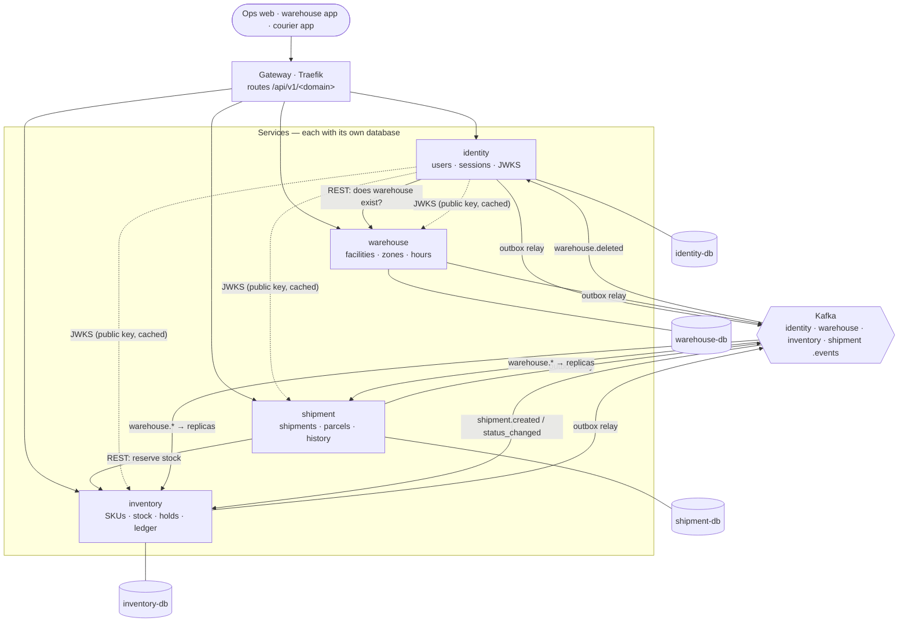

# SmartLogistics — Microservices

Backend for TransFleet's supply-chain and delivery orchestration platform, rebuilt
from the Phase 1 modular monolith into independently deployable services. The
monolith lives on in git history (the `phase_1` branch) for reference.

Each service owns an **isolated database instance**, verifies tokens on its own,
and talks to the others only through **REST** (immediate questions), **Kafka
events** (facts others react to) and, from Week 2, **Temporal** workflows.

## Architecture


```mermaid
flowchart TB
    client([Ops web · warehouse app · courier app])
    gw[Gateway · Traefik<br/>routes /api/v1/&lt;domain&gt;]
    client --> gw

    subgraph services[Services — each with its own database]
        id[identity<br/>users · sessions · JWKS]
        wh[warehouse<br/>facilities · zones · hours]
        inv[inventory<br/>SKUs · stock · holds · ledger]
        shp[shipment<br/>shipments · parcels · history]
    end
    gw --> id & wh & inv & shp

    id --- iddb[(identity-db)]
    wh --- whdb[(warehouse-db)]
    inv --- invdb[(inventory-db)]
    shp --- shpdb[(shipment-db)]

    shp -- "REST: reserve stock" --> inv
    id -- "REST: does warehouse exist?" --> wh
    id -. "JWKS (public key, cached)" .-> wh & inv & shp

    kafka{{Kafka<br/>identity · warehouse · inventory · shipment .events}}
    id & wh & inv & shp -- outbox relay --> kafka
    kafka -- "warehouse.* → replicas" --> inv & shp
    kafka -- "shipment.created / status_changed" --> inv
    kafka -- "warehouse.deleted" --> id
```

| Service | Owns | Publishes | Consumes | Calls |
|---|---|---|---|---|
| **identity** | users, refresh tokens, operator↔warehouse scopes | `user.*` | `warehouse.deleted` (drop scopes) | warehouse (validate an assignment) |
| **warehouse** | warehouses, zones, operating hours | `warehouse.*` (full snapshots) | — | — |
| **inventory** | SKUs, stock positions, holds, stock ledger, warehouse replica | `stock.*` | `warehouse.*`, `shipment.created` (confirm hold), `shipment.status_changed` (commit / release) | — |
| **shipment** | shipments, items, parcels, status history, warehouse replica | `shipment.*` | `warehouse.*` | inventory (reserve, release) |

Courier, orchestrator (Temporal), tracking, notification and analytics services
arrive in Weeks 2–3; the AI assistant and indexer in Weeks 4–5. The full plan is in
the *Microservices Migration Plan* doc.

## How the hard parts work

**Authentication.** Identity signs RS256 access tokens whose claims carry role,
warehouse scope and courier id. Every other service fetches Identity's public key
from `/.well-known/jwks.json` once, caches it in memory, and verifies tokens
locally — no service calls Identity on the request path.

**Creating a shipment (reserve, then record).**
1. Shipment checks the origin warehouse against its *local replica* (built from
   `warehouse.*` events) — no call.
2. It calls Inventory to hold the stock (the one synchronous hop). Rows are locked
   in id order; a shortfall is Inventory's own `409 insufficient_stock`.
3. It inserts the shipment, items (SKU snapshots returned by Inventory), the first
   history row and a `shipment.created` outbox row — one transaction.
4. Inventory consumes `shipment.created` and **confirms** the hold. Confirmed holds
   never expire; only holds whose shipment never materialised are reclaimed.

**Consistency.** Every event is written to an `outbox_events` table in the same
transaction as the change and relayed to Kafka. Consumers record the event id in
`processed_events` in the same transaction as their effect, so redelivery is a
no-op on any pod. Write endpoints accept `Idempotency-Key` (scoped per caller,
leased, atomic with the work). Shipment status changes are protected by a real
optimistic lock (`version_id_col`).

**No foreign keys across services.** References are plain ids. Display fields are
snapshotted (warehouse code, SKU name); cascades became events (deleting a
warehouse removes operator scopes in Identity via `warehouse.deleted`).

## Run it

```bash
make keys          # Identity's signing key -> infra/keys/jwt-private.pem (git-ignored)
make up            # builds 4 images; starts 4 Postgres instances, Kafka, gateway, Jaeger
make seed          # warehouses, users, SKUs and stock
```

```bash
TOKEN=$(curl -s localhost:8000/api/v1/auth/login -H 'content-type: application/json' \
  -d '{"email":"support.lead@transfleet.com","password":"SmartLogistics!2026"}' | jq -r .access_token)
curl -s localhost:8000/api/v1/shipments -H "Authorization: Bearer $TOKEN" | jq
```

| URL | What |
|---|---|
| http://localhost:8000 | Gateway — every API |
| http://localhost:800{1,2,3,4}/docs | Each service's Swagger UI |
| http://localhost:8080 | Traefik dashboard |
| http://localhost:16686 | Jaeger traces |
| `docker compose --profile tools up -d kafka-ui` → :8090 | Kafka UI |

Seeded accounts (password `SmartLogistics!2026`): `admin@`, `support.lead@`,
`wh.karachi@`, `wh.lahore@`, `wh.regional@`, `courier.one@` … `@transfleet.com`.

## Develop and test

```bash
make install       # one uv workspace venv with every service
make test          # platform unit tests, each service's suite, cross-service e2e
make test-shipment # one service
make lint          # ruff + import-linter (services may never import each other)
make check         # lint + `alembic check` per service
```

Service suites run against a real Postgres (`<service>_test` databases built from
the migrations). `tests/e2e` loads all four services into one process, each on its
own database, joined by an in-memory event bus in place of Kafka — it proves the
services cooperate only through HTTP and events.

## Repository layout

```
libs/sl-platform/      shared plumbing only: auth, db, idempotency, outbox, consumer,
                       service client, app factory, worker runner, test helpers
services/<name>/
  src/<name>/          config, db, models, schemas, repository, services/, api/,
                       events.py (publish + consume), main.py (HTTP), worker.py, seed.py
  migrations/          the service's own Alembic chain
  tests/
infra/docker/          one Dockerfile for all services (ARG SERVICE) + entrypoint
infra/keys/            generated signing key (git-ignored)
tests/e2e/             cross-service flows
docs/                  architecture, ADRs, database notes, briefs
```

## Tech stack

Python 3.13 · FastAPI · SQLAlchemy 2 (async) · PostgreSQL 16 (one per service) ·
Alembic · Kafka (KRaft) via aiokafka · PyJWT (RS256/JWKS) · Argon2 · httpx ·
Traefik · OpenTelemetry → Jaeger · uv workspace · Ruff · import-linter · pytest ·
Docker Compose. Coming next: Temporal, Celery + RabbitMQ, Schema Registry,
MongoDB (tracking), Redis, Prometheus + Grafana, LangGraph + Qdrant.
