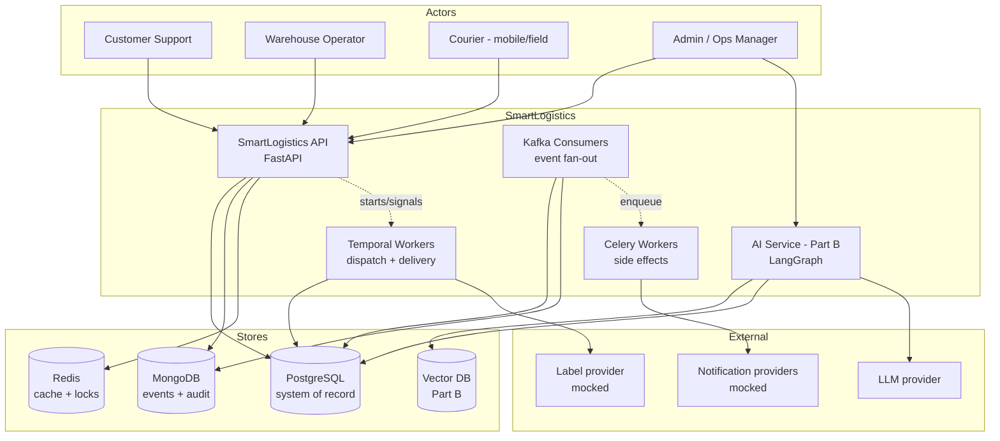
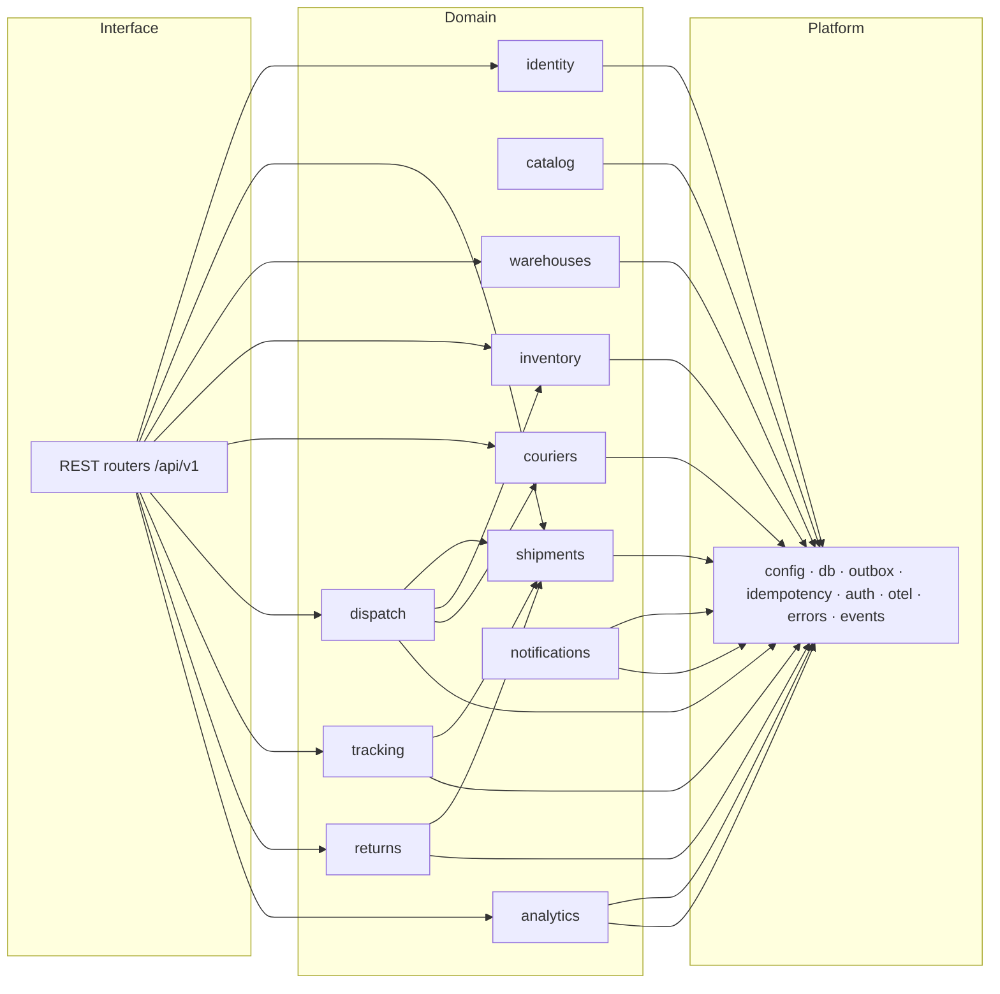
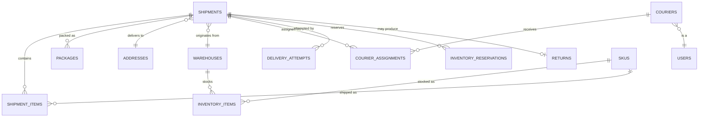
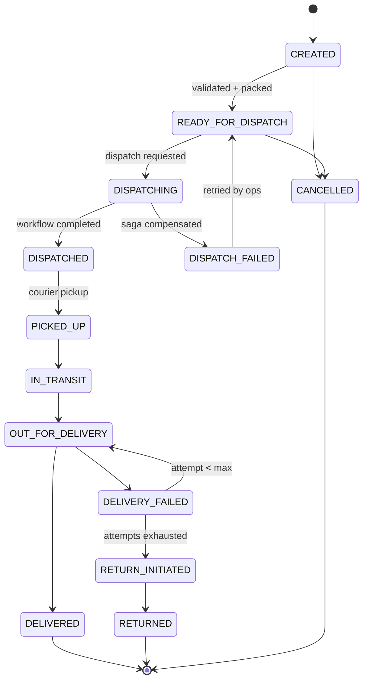
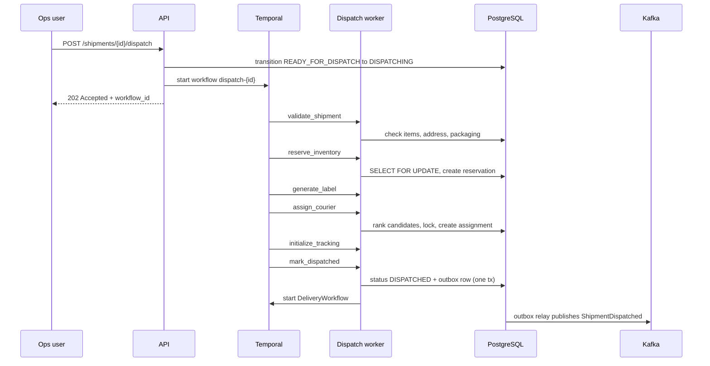
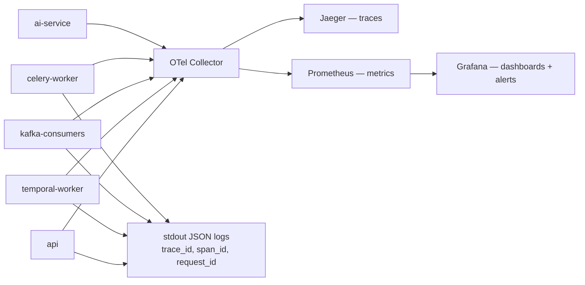
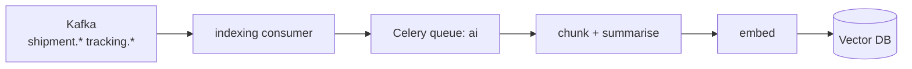

# SmartLogistics — Technical Architecture

**Project:** SmartLogistics — Intelligent Supply Chain & Delivery Orchestration Platform
**Client:** TransFleet
**Component:** Backend platform (Part A) + GenAI layer (Part B)
**Status:** Draft for review
**Last updated:** 2026-09-04

---

## Table of Contents

1. [Purpose and Scope](#1-purpose-and-scope) · [1.1 Requirement coverage](#11-requirement-coverage)
2. [Architectural Drivers](#2-architectural-drivers)
3. [System Context](#3-system-context)
4. [Deployment Shape and Process Topology](#4-deployment-shape-and-process-topology)
5. [Module Architecture](#5-module-architecture)
6. [Data Architecture](#6-data-architecture)
7. [Shipment Lifecycle and State Machine](#7-shipment-lifecycle-and-state-machine)
8. [Workflow Architecture (Temporal)](#8-workflow-architecture-temporal)
9. [Event Architecture (Kafka)](#9-event-architecture-kafka)
10. [Async Responsibility Boundaries](#10-async-responsibility-boundaries)
11. [Consistency and Idempotency Model](#11-consistency-and-idempotency-model)
12. [API and Security Architecture](#12-api-and-security-architecture)
13. [Observability Architecture](#13-observability-architecture)
14. [Part B — GenAI Layer Architecture](#14-part-b--genai-layer-architecture)
15. [Runtime Topology](#15-runtime-topology)
16. [Repository Layout](#16-repository-layout)
17. [Architecture Decision Records](#17-architecture-decision-records)
18. [Non-Functional Targets](#18-non-functional-targets)
19. [Assumptions, Open Questions and Risks](#19-assumptions-open-questions-and-risks)
20. [Delivery Roadmap Mapping](#20-delivery-roadmap-mapping)

---

## 1. Purpose and Scope

This document defines the technical architecture of the SmartLogistics backend. It is the reference for module boundaries, data ownership, workflow and event design, consistency guarantees, and observability.

It also carries the requirement traceability the brief asks for. No separate PRD was written: a second document restating the brief would drift from this one within a week, so the mapping from each stated requirement to the design that answers it lives in [§1.1](#11-requirement-coverage) below, non-functional targets in [§18](#18-non-functional-targets), and the delivery timeline in [§20](#20-delivery-roadmap-mapping).

**In scope:** shipment lifecycle, warehouse and inventory operations, dispatch orchestration, courier assignment, tracking and delivery, returns, notifications, analytics, and the GenAI assistant layer.

**Out of scope:** frontend applications, real carrier/EDI integrations, real payment processing, production infrastructure (cloud accounts, Terraform, managed Kafka), and geospatial route optimisation against live map data. External providers are represented by mock adapters behind stable interfaces (see [ADR-014](#adr-014-mock-external-provider-adapters)).

### 1.1 Requirement coverage

Every functional requirement in *SmartLogistics — Part A*, mapped to the design that answers it and
to its status at the end of Week 1. Status is what is **built and verified**, not what is designed —
the design for all of it is in this document.

| # | Requirement (Part A) | Where | Status |
|---|---|---|---|
| **1** | Shipment, package, address and metadata CRUD | [§5](#5-module-architecture), [§7](#7-shipment-lifecycle-and-state-machine) | ✅ Built — 42 endpoints |
| | User registration with four roles | [§12](#12-api-and-security-architecture), [ADR-009](#adr-009-jwt-with-role-gate-plus-row-level-scoping) | ✅ Built — role gate plus row-level scoping |
| | Courier profile management and availability | [§5](#5-module-architecture) | 🟡 Data model and seed data ready; endpoints are Week 2 |
| | Shipment history and audit trail | [ADR-002](#adr-002-postgres-as-system-of-record-mongodb-for-event-streams) | 🟡 Lifecycle timestamps and the stock ledger are persisted; the Mongo audit stream is Week 3 |
| **2** | Dispatch workflow — validate, reserve, label, assign, track, mark dispatched | [§8](#8-workflow-architecture-temporal) | 🟡 State machine, stock reservation and idempotency built; Temporal saga is Week 2 |
| | Partial failures must not corrupt shipment state | [D1](#2-architectural-drivers), [§11](#11-consistency-and-idempotency-model) | ✅ Transitions are validated in one place and applied in the same transaction as their stock effect |
| **3** | Delivery workflow — pickup, updates, attempts, confirmation | [§7](#7-shipment-lifecycle-and-state-machine) | 🟡 All custody transitions and attempt counting built; orchestration is Week 2 |
| | Idempotent retries and duplicate prevention | [ADR-006](#adr-006-layered-idempotency), [§11](#11-consistency-and-idempotency-model) | ✅ `Idempotency-Key` with request-hash comparison, verified under concurrency |
| **4** | Event-driven behaviours, traceable and recoverable, no double-processing | [§9](#9-event-architecture-kafka), [ADR-003](#adr-003-transactional-outbox-for-event-publishing) | 🔴 Week 3 |
| **5** | Analytics metrics — nine listed | [§10](#10-async-responsibility-boundaries) | 🔴 Week 3 |
| **6** | Observability, monitoring, failure diagnosis | [§13](#13-observability-architecture), [ADR-010](#adr-010-opentelemetry-first-with-async-context-propagation) | 🟡 Liveness and readiness probes built; tracing and dashboards are Week 3 |

**Tech stack**, as mandated by the brief:

| Layer | Required | Status |
|---|---|---|
| Backend | Python, FastAPI, PostgreSQL, a NoSQL store, Redis | ✅ Python 3.13, FastAPI, PostgreSQL 16. 🟡 MongoDB and Redis are configured and running but no code reads them yet |
| Async | Celery + RabbitMQ, Kafka + Schema Registry, Temporal | 🔴 Weeks 2–3, designed in [§8](#8-workflow-architecture-temporal)–[§10](#10-async-responsibility-boundaries) |
| Observability | Prometheus, Grafana, Jaeger, OpenTelemetry | 🔴 Week 3, designed in [§13](#13-observability-architecture) |
| DevOps | Docker, Docker Compose | ✅ Multi-stage image and Compose stack, plus Kubernetes manifests beyond the brief — see [deploy/README.md](../deploy/README.md) |

Nothing in the mandated stack has been substituted. The items marked 🔴 are scheduled, not skipped;
[§20](#20-delivery-roadmap-mapping) says which week each lands in.

---

## 2. Architectural Drivers

The architecture is shaped by six forces taken directly from the problem statement.

| # | Driver | Source requirement | Architectural response |
|---|---|---|---|
| D1 | **Partial failures must not corrupt shipment state** | Dispatch workflow | Temporal saga with per-step compensation ([§8](#8-workflow-architecture-temporal)) |
| D2 | **Inventory must stay consistent across warehouses** | Business goals | Single transactional system of record, row-level pessimistic locking, reservation model with expiry ([§11](#11-consistency-and-idempotency-model)) |
| D3 | **Tracking events are delayed, duplicated or lost** | Problem statement | Layered idempotency, at-least-once delivery with effectively-once processing, DLQs ([§9](#9-event-architecture-kafka), [§11](#11-consistency-and-idempotency-model)) |
| D4 | **Background work must not block user-facing traffic** | Distributed behaviours | Process-type separation; API never performs side effects inline ([§4](#4-deployment-shape-and-process-topology)) |
| D5 | **Peak spikes and high concurrent status updates** | Scalability goals | Queue-backed workers scaled independently of the API; append-optimised event store ([§6](#6-data-architecture)) |
| D6 | **Failures must be diagnosable across async hops** | Observability expectations | OpenTelemetry with trace context propagated through Kafka, Celery and Temporal ([§13](#13-observability-architecture)) |

Every significant decision in this document traces back to one of these drivers.

---

## 3. System Context



**Trust boundary:** every actor is authenticated; couriers are the least-trusted authenticated role and receive row-scoped access to their own assignments only ([§12](#12-api-and-security-architecture)).

---

## 4. Deployment Shape and Process Topology

SmartLogistics is a **modular monolith with process-type separation**: one codebase, one container image, five entrypoints. See [ADR-001](#adr-001-modular-monolith-with-process-type-separation) for the full rationale and the microservices comparison.

| Process | Entrypoint | Responsibility | Scaling trigger |
|---|---|---|---|
| `api` | `uvicorn app.main:app` | Synchronous request handling only | Request rate, p95 latency |
| `temporal-worker` | `app.workflows.worker` | Executes dispatch and delivery workflows and activities | Workflow task queue depth |
| `kafka-consumers` | `app.consumers.runner` | Consumes domain events, updates projections, fans out | Consumer lag |
| `celery-worker` | `celery -A app.workers.celery_app worker` | Leaf-node side effects | Queue depth per queue |
| `celery-beat` | `celery -A app.workers.celery_app beat` | Scheduled jobs: rollups, reservation reaper, SLA sweeps | n/a — singleton |

**Why process separation matters here:** it delivers the isolation that motivates microservices — a saturated consumer group or a hung notification provider cannot consume API workers — without splitting the transactional core into distributed sagas. Each process type scales independently, which is the axis that actually matters under the peak-season spikes described in the brief (D5).

**The API never performs side effects inline** (D4). A request handler may write to Postgres and Mongo, enqueue work, start or signal a workflow, and return. It never sends a notification, renders a document, or calls an LLM on the request path.

### 4.1 Preserving extractability

Module boundaries are enforced so that any module can later become a service without a rewrite:

- one **Postgres schema per module**, so the split lines are already drawn in the data ([ADR-008](#adr-008-schema-per-module-in-a-single-database))
- **no cross-module imports** except through a module's published service interface
- non-query cross-module communication already flows through domain events rather than direct calls

**Amended 2026-09-07:** cross-schema foreign keys *are* now used. The original rule forbade them to keep extraction free of constraint drops; in practice it left 15 references unprotected, with integrity resting on the service layer remembering to check. ADR-008 records the reversal. Extraction now needs a `DROP CONSTRAINT` first — mechanical, and a fair price for integrity that cannot be bypassed.

Extraction therefore reduces to moving a package, dropping the foreign keys that cross the new boundary, and replacing an in-process service call with an event or an HTTP client.

---

## 5. Module Architecture



| Module | Owns | Publishes | Notes |
|---|---|---|---|
| `identity` | Users, roles, credentials, tokens | `user.*` | Four roles: `admin`, `customer_support`, `warehouse_operator`, `courier` |
| `catalog` | SKUs / product master | — | Deliberately thin; weights and dimensions feed packaging and courier capacity |
| `warehouses` | Warehouses, locations, capacity | `warehouse.*` | Multi-city coordination |
| `inventory` | Stock levels, reservations, commit/release | `inventory.*` | The consistency-critical module (D2) |
| `shipments` | Shipment aggregate, items, packages, addresses, state machine | `shipment.*` | Aggregate root of the domain |
| `couriers` | Courier profiles, availability, capacity, assignment records | `courier.*` | Candidate ranking lives here |
| `dispatch` | Dispatch entrypoint and policy | `dispatch.*` | Thin — orchestration itself belongs to Temporal |
| `tracking` | Tracking events, milestones, delivery attempts | `tracking.*` | Highest write volume |
| `returns` | Return initiation and lifecycle | `return.*` | Triggered by failed-delivery policy |
| `notifications` | Templates, channel adapters, delivery log | — | Consumer-driven; never called from the API path |
| `analytics` | Rollup tables, metric queries | — | Read model built by consumers |
| `platform` | Cross-cutting: config, sessions, outbox, idempotency, auth deps, telemetry, error model | — | Not a domain module; may be imported by all |

**Layering inside each module** is uniform: `router.py` (HTTP, validation, auth) → `service.py` (business rules, transactions, published interface) → `repository.py` (persistence) → `models.py` / `schemas.py` / `events.py` / `state_machine.py`. Business logic never lives in a router; ORM models never cross the router boundary.

---

## 6. Data Architecture

Three stores, each chosen for a distinct access pattern. See [ADR-002](#adr-002-postgres-as-system-of-record-mongodb-for-event-streams).

### 6.1 PostgreSQL — system of record

Everything transactional and relational. All state that a business decision depends on.

| Schema | Key tables |
|---|---|
| `identity` | `users`, `refresh_tokens` |
| `catalog` | `skus` |
| `warehouses` | `warehouses`, `warehouse_zones`, `warehouse_operating_hours` |
| `inventory` | `inventory_items` (unique on `warehouse_id, sku_id`; `on_hand_qty`, `reserved_qty`, `version`), `inventory_reservations` (`shipment_id`, `status`, `expires_at`) |
| `shipments` | `shipments`, `shipment_items`, `packages`, `addresses` |

| `couriers` | `couriers`, `courier_assignments` |
| `tracking` | `delivery_attempts` (relational projection; full event history lives in Mongo) |
| `returns` | `returns` |
| `analytics` | `metric_daily_rollup`, `courier_utilization_daily`, `warehouse_throughput_daily` |
| `platform` | `outbox_events`, `processed_messages`, `idempotency_keys` |

**Core relationships:**



Notable columns: `shipments.version` for optimistic concurrency, `shipments.dispatch_workflow_id` linking to Temporal, `shipments.reference_no` as the human-facing identifier, and `promised_delivery_at` driving SLA escalation.

### 6.2 MongoDB — append-only operational history

High-volume, write-heavy, schema-evolving data that must never bloat the OLTP tables (D5).

| Collection | Purpose | Key indexes |
|---|---|---|
| `tracking_events` | Every milestone from couriers, scanners and systems | `{shipment_id, occurred_at}`; **unique** `{shipment_id, client_event_id}` for dedupe |
| `audit_trail` | Before/after snapshot of every shipment mutation, with actor | `{entity_type, entity_id, at}` |
| `notification_log` | Every notification attempt and outcome | `{shipment_id, at}`, `{status}` |
| `ai_interactions` | Part B: prompts, retrieved context, responses, latency, token usage | `{user_id, at}` |

**Division of responsibility:** Mongo holds the *history*; Postgres holds the *current state*. A shipment's status is a denormalised projection in Postgres so state transitions remain transactional and joinable, while the unbounded event stream lives in Mongo. This is the single most important data decision in the system and is recorded as [ADR-002](#adr-002-postgres-as-system-of-record-mongodb-for-event-streams).

### 6.3 Redis — cache, locks and coordination

| Use | Key shape | TTL |
|---|---|---|
| Hot shipment read cache | `shipment:{id}` | 60s, invalidated on transition |
| Courier availability index | `courier:available:{city}` (sorted set by current load) | 30s |
| Assignment lock | `lock:courier:{id}` | 10s, `SET NX PX` |
| Idempotency fast path | `idem:{key}` | 24h, Postgres remains authoritative |
| Rate limiting | `rl:{subject}:{window}` | window |
| Celery result backend | — | 1h |

Redis is **never** a system of record; every entry is reconstructible from Postgres.

---

## 7. Shipment Lifecycle and State Machine



The allowed-transition map is declared **once**, in `shipments/state_machine.py`, and is the only place a transition is authorised. Rules:

- an illegal transition raises a domain error surfaced as **409 Conflict** — never a silent write
- every transition is applied with **optimistic concurrency** on `shipments.version`; a lost update returns 409 and the caller retries
- every transition writes an outbox row **in the same transaction** as the state change
- every transition appends to `audit_trail` with the acting user, source, and before/after values

`DISPATCHING` is deliberately a distinct state: it makes an in-flight workflow visible to operators and blocks a second dispatch attempt at the data layer as well as at the workflow layer.

---

## 8. Workflow Architecture (Temporal)

### 8.1 DispatchWorkflow — a saga

**Workflow ID:** `dispatch-{shipment_id}` with `WorkflowIdReusePolicy.REJECT_DUPLICATE`. A second dispatch request for the same shipment cannot start a second workflow — duplicate prevention by construction, not by convention (D3).



| Step | Activity | Compensation | Retry policy |
|---|---|---|---|
| 1 | `validate_shipment` | — | 3 attempts, non-retryable on validation error |
| 2 | `reserve_inventory` | `release_inventory` | 5 attempts, exponential backoff |
| 3 | `generate_label` | `void_label` | 5 attempts |
| 4 | `assign_courier` | `unassign_courier` | 5 attempts, then next candidate |
| 5 | `initialize_tracking` | `delete_tracking_journey` | 3 attempts |
| 6 | `mark_dispatched` | — | 5 attempts, idempotent |

**Failure semantics (D1):** if any step exhausts its retries, the workflow runs the compensations of all completed steps **in reverse order** and lands the shipment in `DISPATCH_FAILED`. There is no state in which a shipment is partially dispatched or holding phantom stock. Compensations are themselves idempotent and retried by Temporal.

**Courier assignment** deserves specific mention: candidates are ranked by city match, remaining capacity against `max_daily_shipments`, availability window, and historical rating. The chosen courier is locked in Redis (`SET NX PX 10s`) before the assignment row is written; on lock contention or explicit rejection the activity falls through to the next candidate. This prevents double-booking under the concurrent dispatch batches described in the brief.

### 8.2 DeliveryWorkflow — long-running, signal-driven

**Workflow ID:** `delivery-{shipment_id}`. Started by `DispatchWorkflow` on success and lives until the shipment reaches a terminal state.

- receives courier status updates as **signals** (`pickup_recorded`, `status_updated`, `delivery_attempted`)
- holds a **durable timer** against `promised_delivery_at`; on expiry it raises an SLA-breach escalation event
- counts delivery attempts and initiates a return once `max_attempts` is exhausted
- is the **single writer** for delivery-phase state transitions, which removes an entire class of concurrent-update races

This is where Temporal earns its place over a cron job or a Celery chain: durable timers, replayable history, and signal handling survive worker restarts and deploys.

---

## 9. Event Architecture (Kafka)

### 9.1 Transactional outbox — no dual writes

Writing to Postgres and publishing to Kafka in the same operation is not atomic. Rather than accept lost or phantom events (D3), every producer writes the business change and an `outbox_events` row **in one transaction**; a relay process polls unpublished rows, publishes to Kafka, and marks them published.

```mermaid
sequenceDiagram
    participant SVC as Service
    participant PG as PostgreSQL
    participant REL as Outbox relay
    participant K as Kafka
    participant CON as Consumer

    SVC->>PG: BEGIN; write state + outbox row; COMMIT
    REL->>PG: poll unpublished rows
    REL->>K: publish, key = shipment_id
    REL->>PG: mark published
    K->>CON: deliver at least once
    CON->>PG: BEGIN; apply effect + processed_messages row; COMMIT
```

Guarantee: **at-least-once delivery, effectively-once processing**. A crash between publish and mark-published causes a redelivery, which the consumer's dedupe table absorbs.

### 9.2 Topics

All topics use **Avro with Confluent Schema Registry** under `BACKWARD` compatibility, and are **keyed by `shipment_id`** so that all events for one shipment land on one partition and are consumed in order — the ordering guarantee that makes the tracking projection correct.

| Topic | Events | Partitions | Retention |
|---|---|---|---|
| `shipment.events.v1` | `ShipmentCreated`, `ShipmentUpdated`, `ShipmentCancelled`, `ShipmentDispatched`, `ShipmentDelivered` | 6 | 7d |
| `dispatch.events.v1` | `DispatchStarted`, `DispatchCompleted`, `DispatchFailed` | 3 | 7d |
| `courier.events.v1` | `CourierAssigned`, `CourierReassigned`, `CourierRejected` | 3 | 7d |
| `tracking.events.v1` | `TrackingMilestoneRecorded`, `DeliveryAttempted` | 6 | 7d |
| `inventory.events.v1` | `StockReserved`, `StockCommitted`, `StockReleased` | 3 | 7d |
| `return.events.v1` | `ReturnInitiated`, `ReturnCompleted` | 3 | 7d |
| `<topic>.dlq` | Poison messages with failure metadata | 1 | 30d |

**Envelope** (common to every event): `event_id` (UUID), `event_type`, `event_version`, `occurred_at`, `producer`, `trace_id`, `correlation_id`, `aggregate_type`, `aggregate_id`, `payload`.

### 9.3 Consumer groups

| Group | Subscribes | Effect |
|---|---|---|
| `notifications` | `shipment.*`, `tracking.*`, `return.*` | Enqueues Celery notification tasks |
| `analytics` | all business topics | Updates rollup tables in `analytics` schema |
| `audit` | all business topics | Appends to Mongo `audit_trail` |
| `indexing` (Part B) | `shipment.*`, `tracking.*` | Enqueues embedding generation |

**Failure handling:** bounded in-consumer retries with backoff, then the message is routed to `<topic>.dlq` with the error, stack reference and attempt count. A poison message never blocks its partition. DLQ depth is an alerting metric ([§13](#13-observability-architecture)) and a replay CLI is provided for recovery.

---

## 10. Async Responsibility Boundaries

Three asynchronous systems are mandated by the stack. Without an explicit boundary they overlap and the design becomes unexplainable. The rule:

> **If it must be un-done, it is Temporal. If others need to know, it is Kafka. If it is simply work, it is Celery.**

| System | Used for | Never used for |
|---|---|---|
| **Temporal** | Multi-step business processes needing durable state, compensation and timers: dispatch, delivery lifecycle, returns | Fire-and-forget side effects; broadcasting facts |
| **Kafka** | Broadcasting facts that already happened to N unknown consumers | Command-and-control; request/response |
| **Celery + RabbitMQ** | Leaf-node side effects: send notification, render label PDF, compute rollup, generate embeddings | Multi-step orchestration; anything requiring compensation |

Celery tasks are organised into dedicated queues — `notifications`, `documents`, `analytics`, `ai` — so a slow LLM or document job cannot starve customer notifications.

**Scheduled jobs** (`celery-beat`): expired-reservation reaper (every minute), daily analytics rollup, SLA sweep for shipments approaching `promised_delivery_at`, outbox cleanup.

---

## 11. Consistency and Idempotency Model

Idempotency is named three times in the requirements; it is handled at four distinct layers because each solves a different problem.

| Layer | Mechanism | Solves |
|---|---|---|
| **1. API** | `Idempotency-Key` header on POST/PATCH; key, request-body hash and cached response stored in `idempotency_keys` | Client retries after a timeout; double-submitted dispatch requests |
| **2. Workflow** | Deterministic workflow IDs + `REJECT_DUPLICATE` | Two operators dispatching the same shipment |
| **3. Consumer** | `processed_messages` row written in the same transaction as the effect | Kafka redelivery and rebalance replays |
| **4. Ingestion** | Unique index on `{shipment_id, client_event_id}` in Mongo | A courier device replaying offline-queued updates (D3) |

Replaying an API key with a **different** body is a `422` — a silent overwrite would be worse than an error.

### 11.1 Concurrency control

| Resource | Strategy | Reason |
|---|---|---|
| `inventory_items` | **Pessimistic** — `SELECT ... FOR UPDATE` on the row inside the reservation transaction | Contention is real and correctness is non-negotiable (D2); a lost update oversells stock |
| `shipments.status` | **Optimistic** — `version` column, 409 on conflict | Contention is rare; retries are cheap and avoid holding locks across a workflow |
| Courier assignment | **Distributed lock** — Redis `SET NX PX` | Coordination spans processes, not a single transaction |

### 11.2 Inventory reservation lifecycle

```
HELD ──commit──► COMMITTED     (shipment dispatched, stock leaves)
  │
  ├──release──► RELEASED       (saga compensation or cancellation)
  └──expire───► RELEASED       (reaper, after expires_at)
```

Reservations carry `expires_at`. If a dispatch workflow dies in a way Temporal cannot compensate — worker loss, catastrophic failure — the reaper releases the hold within a minute. Stock can therefore never be permanently stranded, which is the failure mode most likely to appear under load and hardest to notice.

### 11.3 Tracking ingestion path

The highest-volume write path in the system, and the one the brief explicitly calls out as unreliable today:

1. courier `POST /tracking-events` with a `client_event_id`
2. append to Mongo `tracking_events` — the unique index makes this naturally idempotent, so a retry is a no-op
3. signal `DeliveryWorkflow`
4. the workflow's activity applies the Postgres state transition **and** writes the outbox row in one transaction

**Tradeoff:** the shipment's queryable status is updated a few tens of milliseconds after the event is accepted, rather than in the request. In exchange, the DeliveryWorkflow remains the single writer of delivery-phase state, and out-of-order or duplicated field updates cannot corrupt the status. The API returns the accepted event immediately, so perceived responsiveness is unaffected.

---

## 12. API and Security Architecture

**Conventions:** all routes under `/api/v1`; cursor pagination on collections; `RFC 7807` problem-detail error bodies with a stable `code`; `X-Request-ID` accepted or generated and echoed; long-running operations return `202 Accepted` with a status URL rather than blocking.

**Authentication:** JWT access tokens (short-lived) plus refresh tokens, Argon2id password hashing, token revocation on logout.

**Authorization is two-layered** — role checks alone are insufficient here:

1. **Role gate** — a FastAPI dependency asserting the endpoint's required role
2. **Row-level scoping** — enforced in the repository layer: a courier sees only shipments assigned to them, a warehouse operator only their warehouse's stock and shipments

| Role | Capabilities |
|---|---|
| `admin` | Full access, including analytics and configuration |
| `customer_support` | Create/update shipments, view tracking, initiate returns |
| `warehouse_operator` | Manage stock and packaging for their warehouse; mark ready for dispatch |
| `courier` | View own assignments; post tracking events and delivery outcomes for own shipments only |

Additional controls: rate limiting per subject on write endpoints, strict Pydantic validation at the boundary, no secrets in code (all config via environment), and audit logging of every mutation with the acting user.

---

## 13. Observability Architecture

OpenTelemetry is the single instrumentation layer; traces, metrics and logs are correlated by `trace_id` (D6).



**The differentiating capability is context propagation across async hops.** Trace context is injected into Kafka message headers, Celery task headers, and Temporal activity inputs, so a single trace spans `API → outbox → Kafka → consumer → Celery → notification`. Diagnosing "where did this tracking update go?" becomes one trace lookup rather than five log searches — precisely the diagnosability the brief asks for.

**Metrics:**

- *RED* on the API: rate, errors, duration per route
- *Pipeline*: consumer lag per group, DLQ depth, outbox backlog age, Celery queue depth, workflow start/complete/fail counts, activity retry counts
- *Business*: the nine metrics required by Part A — total shipments, dispatched over time, delivered, failed deliveries, average delivery time, courier utilisation, warehouse throughput, return rate, failed events/workflow issues

**Dashboards:** `API Health`, `Pipeline Health`, `Business KPIs`, and in Part B `AI Operations`.

**Alerts** (Grafana): consumer lag above threshold, DLQ non-empty, outbox backlog ageing, dispatch failure rate spike, workflow failure rate spike.

**Logging:** structured JSON to stdout, no PII beyond what operations require, every line carrying `trace_id`, `span_id`, `request_id` and `actor_id`.

---

## 14. Part B — GenAI Layer Architecture

The AI layer is the one component deployed as a **separate service** ([ADR-012](#adr-012-ai-layer-as-a-separate-service)): it has a different scaling profile (LLM latency, long-lived streaming connections), a different dependency set, and a hard isolation requirement — a hung LLM provider call must never affect dispatch traffic. It integrates over Kafka and read-only queries, so no transaction is split.

### 14.1 Ingestion and indexing pipeline



Operational data is not natural prose, so documents are **composed** rather than dumped: a shipment document renders its lifecycle, exceptions and timings into a narrative chunk; warehouse and courier documents render periodic performance summaries. Every vector carries metadata — `shipment_id`, `warehouse_id`, `courier_id`, `city`, `status`, `date` — so retrieval can be filtered before it is semantic. Re-indexing is idempotent, keyed on `{entity_type, entity_id, version}`.

### 14.2 Assistant

A **LangGraph** agent with retrieval and structured-query tools:

- `semantic_search` — filtered vector retrieval over operational documents
- `metrics_query` — parameterised, read-only, allow-listed queries against the analytics rollups
- `shipment_lookup` — direct fetch by reference

The split matters: *"why is warehouse throughput low this week?"* is a retrieval-and-reasoning question, while *"show failed deliveries by region"* is an aggregation the LLM should never hallucinate. The agent routes to the right tool and grounds every claim in retrieved rows.

**Streaming** via SSE with token-level output; requests carry the caller's identity so retrieval is scoped by the same row-level rules as the REST API — an AI assistant must not become an authorization bypass.

**AI observability:** every interaction is logged to `ai_interactions` with retrieved context, latency, token usage and outcome; metrics cover assistant usage, questions asked/answered, response time, and provider error rate. Provider calls are wrapped in a circuit breaker with a timeout budget.

---

## 15. Runtime Topology

One `docker-compose.yml` with the full stack. Application processes share a single image.

> **Status (Week 1).** Five of the services below exist today — `api`, `postgres`, `redis`, plus a
> one-shot `migrate` service and a `test` profile. The rest arrive in the week their concern is
> built. What runs now, and how it deploys to Kubernetes on EKS or AKS, is documented in
> [deploy/README.md](../deploy/README.md).

| Service | Image | Port | Notes |
|---|---|---|---|
| `api` | app | 8000 | FastAPI |
| `temporal-worker` | app | — | Workflow + activity worker |
| `kafka-consumers` | app | — | Consumer group runner |
| `celery-worker` | app | — | Queues: notifications, documents, analytics, ai |
| `celery-beat` | app | — | Scheduler |
| `postgres` | postgres:16 | 5432 | App DB + separate Temporal DB |
| `mongo` | mongo:7 | 27017 | Event and audit store |
| `redis` | redis:7 | 6379 | Cache, locks, Celery backend |
| `rabbitmq` | rabbitmq:3-management | 5672, 15672 | Celery broker |
| `kafka` | confluentinc/cp-kafka (KRaft) | 9092 | Single broker, no ZooKeeper |
| `schema-registry` | confluentinc/cp-schema-registry | 8081 | Avro schemas |
| `kafka-ui` | provectuslabs/kafka-ui | 8085 | Topic inspection |
| `temporal` | temporalio/auto-setup | 7233 | Workflow service |
| `temporal-ui` | temporalio/ui | 8088 | Workflow inspection |
| `otel-collector` | otel/opentelemetry-collector | 4317, 4318 | OTLP ingest |
| `jaeger` | jaegertracing/all-in-one | 16686 | Trace UI |
| `prometheus` | prom/prometheus | 9090 | Metrics |
| `grafana` | grafana/grafana | 3000 | Dashboards, provisioned as code |
| `ai-service` | app-ai | 8001 | Part B |
| `qdrant` | qdrant/qdrant | 6333 | Part B vector store |

Compose profiles (`core`, `events`, `observability`, `ai`) allow a subset to be started during development; the default target brings up everything. All services declare healthchecks, and application processes wait on dependency health before starting.

---

## 16. Repository Layout

The codebase is **layer-first**: one folder per architectural layer, one file per entity inside it. Folders are introduced in the week their concern is built, so the tree always reflects what actually exists.

### 16.1 Current (Week 1)

```
smart-logistics-be/
├── Dockerfile                multi-stage; runtime target is non-root
├── docker-compose.yml        Postgres, Redis, migrate, api (+ seed/test profiles)
├── docker-compose.override.yml   local reload, applied automatically
├── docs/                     architecture, database reference, build log, ADRs, curl collection
├── src/app/
│   ├── constants/            system-defined enums, patterns and defaults — single source of truth
│   ├── controllers/          routes, dependencies, RBAC gates
│   ├── services/             business logic, transaction boundaries
│   ├── repositories/         database access
│   ├── models/               SQLAlchemy models, one file per entity
│   ├── schemas/              Pydantic request / response contracts
│   ├── seeders/              development data, one seeder per entity
│   ├── core/                 config, database, security, tokens, exceptions
│   └── main.py               application factory
├── migrations/               Alembic
├── tests/                    unit, integration, e2e
├── deploy/
│   ├── docker/               container entrypoint
│   └── k8s/                  base manifests + aws / azure overlays
└── scripts/                  API collection generator
```

### 16.2 Added later

| Folder | Week | Purpose |
|---|---|---|
| `src/app/workflows/` | 2 | Temporal workflows, activities, worker |
| `src/app/events/` | 3 | Event envelope, Avro schemas, producers |
| `src/app/consumers/` | 3 | Kafka consumer runners, dedupe, DLQ |
| `src/app/workers/` | 3 | Celery app, tasks, schedules |
| `deploy/prometheus/`, `deploy/grafana/`, `deploy/otel/` | 3 | Observability configuration |
| `src/ai_service/` | 4–5 | Part B: retrieval, indexing, LangGraph agent, tools |

**Conventions**

- One file per entity, named after the singular table name — `models/refresh_token.py`, `services/user_service.py`
- `models/__init__.py` is a registry: every model is imported there so SQLAlchemy can resolve string relationships and Alembic can see full metadata
- Cross-file relationships use `TYPE_CHECKING` imports plus string targets to avoid import cycles

**Tooling in use:** `uv` for dependencies, `Ruff` for lint and format, `SQLAlchemy 2.0` async with `Alembic`, `pytest` against a real PostgreSQL instance the suite builds and migrates itself, Docker and Kustomize for packaging.

**Not yet adopted:** `import-linter` for module-boundary enforcement, pre-commit hooks, and a CI pipeline to run any of it. All three are listed as outstanding in [phase_1.md §13](phase_1.md).

---

## 17. Architecture Decision Records

### ADR-001: Modular monolith with process-type separation

**Context.** The brief requires "clear separation of responsibilities between services/modules" and a distributed, event-driven system, delivered by one engineer in five weeks.

**Decision.** Build a modular monolith with strict module boundaries, deployed as five process types from one image. Extract only the Part B AI layer as a separate service.

**Rationale.** The forces that justify microservices — independent deploy cadence across teams, divergent scaling profiles, organisational ownership — are absent. The forces that *are* present, spike absorption and fault isolation, are satisfied by process-type separation. Critically, true microservices require a database per service, which would turn `reserve_inventory` from a local transaction into a cross-service saga and directly undermine the inventory-consistency requirement (D2) the brief emphasises.

**Consequences.** Independent scaling of API, workflows, consumers and workers; one deployment unit; boundaries must be actively enforced (import-linter, schema-per-module) or they will erode. Extraction remains mechanical if a real force emerges.

**Alternatives rejected.** *Microservices per domain* — high plumbing cost, distributed transactions where local ones suffice, likely to compress Weeks 3–5. *Shared-database microservices* — a distributed monolith: all the operational cost, none of the isolation.

### ADR-002: Postgres as system of record, MongoDB for event streams

**Context.** The stack mandates both a relational and a NoSQL store. Tracking events are unbounded and high-volume; shipment state must be transactional and joinable.

**Decision.** Postgres holds all current state and anything a business decision depends on. Mongo holds append-only history: tracking events, audit trail, notification log, AI interactions. Current shipment status is a denormalised projection in Postgres.

**Consequences.** State transitions stay in ACID transactions alongside the outbox; the OLTP tables stay small under D5 volumes; history is queryable without touching the transactional path. Cost: the projection must be maintained, and the two stores can diverge transiently — bounded by the single-writer workflow rule ([§11.3](#113-tracking-ingestion-path)).

**Alternatives rejected.** *Everything in Postgres* — tracking tables grow unbounded and degrade the hot path. *Mongo as system of record* — no multi-document ACID guarantees for the inventory invariants.

### ADR-003: Transactional outbox for event publishing

**Context.** Writing to Postgres and publishing to Kafka is a dual write; a failure between them loses or fabricates events (D3).

**Decision.** Business change and outbox row commit in one transaction; a relay publishes and marks rows published.

**Consequences.** No lost or phantom events. Adds a relay process and publish latency of one poll interval. At-least-once publication requires consumer-side dedupe, which ADR-006 provides.

**Alternatives rejected.** *Publish inline* — silently lossy. *Kafka transactions across stores* — does not span Postgres and Kafka.

### ADR-004: Temporal for dispatch and delivery orchestration

**Context.** Dispatch is a six-step process where partial failure must not corrupt state (D1); delivery is long-running with timers and external signals.

**Decision.** Model both as Temporal workflows; dispatch as a saga with per-step compensation, delivery as a signal-driven workflow with durable timers.

**Consequences.** Durable, replayable, inspectable execution; compensation is explicit rather than ad hoc; retries are free. Cost: a workflow determinism constraint the team must respect, and one more infrastructure dependency.

**Alternatives rejected.** *Celery chains* — no durable state, no compensation, no replay, and failure recovery becomes bespoke code. *In-process transaction* — cannot span external calls such as label generation.

### ADR-005: Explicit Temporal / Kafka / Celery boundary

**Context.** Three async systems with overlapping capability invite inconsistent use.

**Decision.** Adopt the rule in [§10](#10-async-responsibility-boundaries): un-doable work is Temporal, facts are Kafka, leaf work is Celery.

**Consequences.** Each system has one job and the design is explainable in a sentence. Cost: occasional friction where a task could plausibly sit in two systems; the rule is decisive by design.

### ADR-006: Layered idempotency

**Context.** Duplicate prevention is required at four distinct points, each with different identity semantics.

**Decision.** Implement all four layers in [§11](#11-consistency-and-idempotency-model) rather than a single generic mechanism.

**Consequences.** Duplicates are stopped at the earliest possible point; each layer is independently testable. Cost: four mechanisms to document and test.

### ADR-007: Avro with Schema Registry, BACKWARD compatibility

**Decision.** All Kafka events are Avro-encoded with schemas registered under `BACKWARD` compatibility; a shared envelope carries `event_id`, `trace_id` and `correlation_id`.

**Consequences.** Producers can evolve without breaking consumers; contracts are enforced at publish time rather than discovered in production. Cost: a schema-generation step in the build.

### ADR-008: Schema-per-module in a single database

**Decision.** Each module owns a Postgres schema.

**Amended 2026-09-07 — cross-schema foreign keys are now used.** The original rule forbade them so a module could be extracted without dropping constraints. In practice it left 15 references unprotected, with integrity depending on the service layer remembering to check — and a check-then-act is a race regardless.

Foreign keys are declared wherever the relationship is permanent, with the delete rule chosen per relationship:

| Rule | Used for | Rationale |
|---|---|---|
| `RESTRICT` | stock → SKU / warehouse, shipment → warehouse / courier, shipment item → SKU | The parent must not vanish while records depend on it |
| `SET NULL` | shipment → creator, ledger → actor, courier → user account | The record outlives the account behind it |
| `CASCADE` | zones, hours, shipment items, packages, refresh tokens, warehouse assignments | Children have no meaning without their parent |

**Consequences.** The database rejects orphans outright, and violations are translated into API errors by `core/db_errors.py` rather than pre-empted by hand-written checks. Extraction now requires dropping constraints first — a short, mechanical step rather than a rewrite, a fair price for integrity that cannot be bypassed.

### ADR-009: JWT with role gate plus row-level scoping

**Decision.** Authorise in two layers: endpoint role dependency, then repository-level row scoping.

**Consequences.** Couriers cannot enumerate other couriers' shipments even where the route permits the role — the failure mode blanket RBAC misses. Cost: scoping must be applied consistently, so it is centralised in a base repository and covered by tests.

### ADR-010: OpenTelemetry-first with async context propagation

**Decision.** Instrument everything through OTel; propagate trace context in Kafka headers, Celery headers and Temporal activity inputs.

**Consequences.** End-to-end traces across process boundaries make async failures diagnosable (D6). Cost: manual propagation code at each hop, isolated in `platform/telemetry`.

### ADR-011: Qdrant as vector store — *pending confirmation*

**Decision (proposed).** Use Qdrant for Part B.

**Rationale.** Retrieval here is heavily filtered — by warehouse, city, status and date — before it is semantic. Qdrant's payload filtering handles this natively and scales past what a `pgvector` index would comfortably serve alongside OLTP traffic.

**Alternative.** `pgvector` — one fewer container and joinable with operational tables; weaker filtered/hybrid search and competes with transactional load.

### ADR-012: AI layer as a separate service

**Decision.** Deploy Part B as its own service, integrating over Kafka and read-only queries.

**Rationale.** Different scaling profile, different dependencies, and a hard isolation requirement: a hung LLM provider must never affect dispatch. It is the one place a genuine service boundary is justified — and it splits no transaction.

**Consequences.** One deliberately extracted service with a defensible reason. Cost: a second image and shared-contract discipline.

### ADR-013: Mixed concurrency control

**Decision.** Pessimistic locking for inventory rows, optimistic versioning for shipment status, Redis locks for courier assignment.

**Rationale.** The strategy follows the contention profile and the cost of being wrong: overselling stock is unacceptable, a rare 409 on a status update is not.

### ADR-014: Mock external provider adapters

**Decision.** Label generation, notification channels and route preparation are implemented as adapters behind stable interfaces, with mock implementations that log to Mongo and expose a development inspection endpoint.

**Consequences.** Full workflows are demonstrable end-to-end without third-party accounts; a real provider is a single adapter implementation away. Route preparation is deterministic in Part A and becomes genuinely intelligent in Part B.

### ADR-015: Live tracking and map provider integration

**Context.** Couriers must navigate to warehouses and delivery addresses, and operations must
see where shipments are in real time. A map provider (Google Maps, Mapbox, or an open stack of
OSM + OSRM + Nominatim) supplies geocoding, routing and distance data. Position data arrives at
a far higher rate than any other write in the system.

**Decision.**

1. **Coordinates are plain `latitude`/`longitude` columns**, not PostGIS geometry, until a
   query actually needs spatial indexing. Adding PostGIS later is an additive migration.
2. **Two points per facility.** `latitude`/`longitude` is the centroid, used for distance and
   routing maths; `entrance_latitude`/`entrance_longitude` is the gate a driver is routed to.
   On a large industrial site these differ by hundreds of metres — the difference between
   finding the dock and circling the perimeter.
3. **`map_place_id` holds a provider-stable reference** (Google `place_id`, OSM node, Mapbox
   feature id) so provider calls survive address typos and reformatting.
4. **`geofence_radius_m` per facility.** Arrival and departure are *derived* by testing courier
   pings against this circle, not self-reported by the driver — self-reported arrival is the
   most commonly falsified event in delivery operations.
5. **Position pings live in MongoDB, never Postgres** (extends ADR-002). A courier pinging every
   10 seconds generates ~3,000 rows per shift; multiplied across a fleet this would dominate
   the OLTP tables. The `courier_location_pings` collection carries GeoJSON `Point` geometry, a
   `2dsphere` index, and a TTL index that expires raw pings after 30 days. Only the **last known
   position** is denormalised onto the courier row in Postgres, for "where is my courier now".
6. **The provider sits behind an adapter** (`MapProvider`) exposing `geocode`,
   `reverse_geocode`, `distance_matrix` and `directions`. A mock implementation returns
   deterministic results from seeded coordinates, so workflows are demonstrable without an API
   key or per-call billing, and the real provider is one implementation away (ADR-014).
7. **Geocoding is asynchronous.** Creating a warehouse with an address but no coordinates
   enqueues a Celery geocoding job rather than blocking the request on a third-party call.
   `geocoded_at` records freshness so stale coordinates can be refreshed in bulk.

**Consequences.** Live tracking, geofenced arrival detection and ETA calculation are all
supported by the schema from day one, without a spatial database or a paid API in development.
Costs: proximity queries are Python-side or SQL haversine until PostGIS is introduced, and the
denormalised last-known position must be kept in step with the ping stream.

**Alternatives rejected.** *PostGIS from the start* — a heavier local image and an extension to
manage, for queries not yet written. *Position pings in Postgres* — unbounded growth on the hot
path, the exact failure ADR-002 exists to prevent. *Calling the provider inline during dispatch*
— puts a third-party latency spike and rate limit directly on the critical path.

---

### ADR-016: Soft deletion and archival

**Context.** With foreign keys in place, a hard delete either fails or cascades further than
intended. Historical shipments, audit trails and ledger entries must keep resolving to the rows
they reference.

**Decision.**

1. **Nothing user-facing is hard-deleted.** `SoftDeleteMixin` adds `deleted_at` and `deleted_by`
   to users, warehouses, zones, SKUs, couriers and shipments. `DELETE` endpoints set those and
   return 204; repositories exclude soft-deleted rows by default; `POST /{id}/restore` undoes it.
2. **Deletion also flips domain state** where one exists — a deleted warehouse becomes
   `inactive`, a deleted user `deactivated` with every session revoked — so the record stops
   participating in business logic immediately, not merely in listings.
3. **Partial indexes, not archive tables, for now.** Every hot query filters
   `deleted_at IS NULL`, so an index carrying that predicate stays the size of the live data
   regardless of how much history accumulates. Six such indexes exist, declared on the models so
   `alembic check` keeps model and database in agreement.
4. **Archival is a later, additive step.** When volume justifies it, deleted rows move to an
   `archive` schema mirroring the live tables, driven by a scheduled Celery job with a retention
   window. Nothing in the application layer changes when that happens — the archive is written
   and read only by the job and by analysts.

**Consequences.** Deletes are reversible, referential integrity holds, and table growth is
handled by index scope rather than by moving data. Costs: every query path must respect the
soft-delete filter, centralised in `BaseRepository.active_only`; and unique constraints still
count deleted rows, so a soft-deleted warehouse keeps its code reserved. That is deliberate —
restoring it must not collide with a replacement.

**Alternatives rejected.** *Hard delete with `ON DELETE CASCADE`* — silently destroys history.
*Archive tables from day one* — a second schema to migrate in lockstep, for data volumes that do
not yet exist.

## 18. Non-Functional Targets

| Attribute | Target | Verification |
|---|---|---|
| Throughput | 10,000 shipments/day sustained; 3× seasonal peak | Load test on dispatch + tracking paths |
| API latency | p95 < 150 ms reads, < 300 ms writes (excluding workflow completion) | Prometheus histograms |
| Tracking ingest | 500 events/sec sustained | Load test |
| Dispatch completion | p95 < 30 s end-to-end | Workflow metrics |
| Event processing lag | p95 < 5 s | Consumer lag metric |
| Availability | 99.9% design target; no single-process failure takes down the API | Chaos test: kill each process type |
| Durability | RPO 0 for transactional data; no committed state lost on process crash | Crash tests mid-workflow |
| Recoverability | Every failed workflow and DLQ message replayable | Documented runbook + replay CLI |
| Test coverage | ≥ 80% on domain and service layers | CI gate |
| Security | No secrets in code; all mutations audited; row-level scoping enforced | Review + tests |

---

## 19. Assumptions, Open Questions and Risks

### Assumptions

1. Single-region deployment; multi-region is out of scope.
2. Single Kafka broker and single Temporal cluster are acceptable for the assignment; production would require replication factor ≥ 3.
3. Seed data (warehouses, SKUs, couriers, users) is generated by a fixture script for demonstration.
4. Route "preparation" in Part A is a deterministic stub behind a pluggable interface; no live map or traffic integration.
5. Notification providers are mocked; delivery is logged and inspectable rather than actually sent.
6. Currency, tax and billing are out of scope — SmartLogistics is an operations platform, not a commerce platform.
7. Shipment volumes stated in the brief are the design point; the architecture is not tuned beyond 3× that.

### Open questions

| # | Question | Impact | Default if unanswered |
|---|---|---|---|
| Q1 | Is a literal microservice split expected for Part A? | Fundamental | Modular monolith per ADR-001 |
| Q2 | Qdrant or pgvector for Part B? | Compose topology, retrieval quality | Qdrant per ADR-011 |
| Q3 | Which LLM provider — OpenAI, Groq or Anthropic? | Client abstraction, cost, latency | Provider-agnostic adapter; Anthropic default |
| Q4 | Is a real notification channel expected in the demo? | Adapter implementation | Mock adapters per ADR-014 |
| Q5 | Is a CI pipeline part of the deliverable? | Week 1 scope | Local `make` targets plus a GitHub Actions workflow |

### Risks

| Risk | Impact | Mitigation |
|---|---|---|
| Infrastructure breadth (≈18 containers) overwhelms local development | Slow iteration, lost time | Compose profiles; healthchecks; `make up-core` for day-to-day work |
| Temporal learning curve in Week 2 | Milestone slip | Build dispatch workflow first as a walking skeleton, add compensation second |
| Schema Registry and Avro tooling friction | Week 3 slip | Define the shared envelope and one topic end-to-end before adding the rest |
| Module boundaries erode under time pressure | Loses the ADR-001 argument | `import-linter` contract enforced in CI from Week 1 |
| Observability deferred to the end | Weakest scoring area per the rubric | Instrument the walking skeleton in Week 1; do not retrofit |
| Part B data has poor retrieval quality because operational records are not prose | Weak assistant answers | Compose narrative documents at index time ([§14.1](#141-ingestion-and-indexing-pipeline)) rather than embedding raw rows |

---

## 20. Delivery Roadmap Mapping

| Week | Architecture components delivered |
|---|---|
| **1** | Repository, tooling, Compose stack, `platform` layer, `identity`/`catalog`/`warehouses`/`inventory`/`shipments` modules, state machine, migrations, OTel walking skeleton, health checks |
| **2** | Temporal integration, `DispatchWorkflow` with saga compensation, courier ranking and assignment locking, `DeliveryWorkflow` skeleton, tracking lifecycle, API idempotency layer |
| **3** | Outbox relay, Kafka topics and Avro schemas, consumer groups with dedupe and DLQ, Celery workers and queues, notifications, analytics rollups, Prometheus/Grafana/Jaeger dashboards and alerts |
| **4** | Indexing consumer, document composition, embedding pipeline, vector store, filtered semantic retrieval |
| **5** | LangGraph assistant, tool layer, SSE streaming, delay insight and courier recommendation flows, AI observability dashboard |

Feature-level traceability to the brief's stated requirements is in [§1.1](#11-requirement-coverage).
