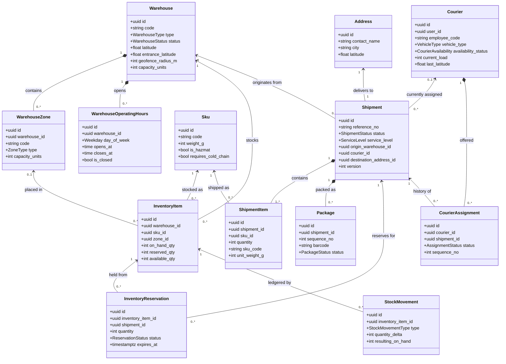
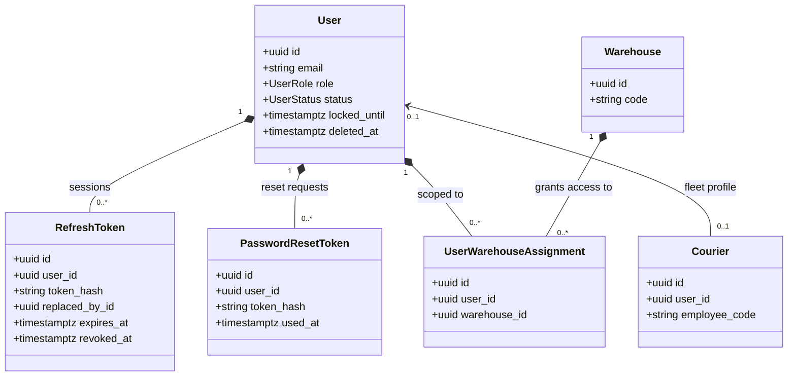

# Database Reference

**Database:** PostgreSQL 16 · **Schemas:** 7 · **Tables:** 18 · **Foreign keys:** 29
**Last updated:** 2026-09-07

Generated from the live database structure. Regenerate after schema changes and check the
descriptions still hold. Design rationale lives in [ARCHITECTURE.md](ARCHITECTURE.md); this
document is the reference for what exists.

---

## How the database is organised

**One schema per module** (ADR-008). Ownership is unambiguous, and the split lines for a future
service extraction are already drawn in the data.

| Schema | Owns | Tables |
|---|---|---|
| `identity` | Accounts, sessions, access scoping | 4 |
| `warehouses` | Facilities, zones, opening hours | 3 |
| `catalog` | Product master | 1 |
| `inventory` | Stock levels, holds, movement ledger | 3 |
| `shipments` | The shipment aggregate and its parts | 4 |
| `couriers` | Fleet profiles, assignment history | 2 |
| `platform` | Cross-cutting infrastructure | 1 |

### Conventions

| Convention | Detail |
|---|---|
| **Primary keys** | `uuid`, application-generated, opaque and non-enumerable |
| **Timestamps** | `timestamptz` everywhere. `created_at` from the database, `updated_at` set Python-side (a database-side `onupdate` forces a row re-read that breaks under asyncio) |
| **Enums** | Native Postgres enums, per schema, whose labels are the lowercase values used by the API |
| **Units** | Weights in **grams**, dimensions in **millimetres**, as integers — summing hundreds of items with floats drifts |
| **Money** | `numeric(12,2)` with an explicit currency column; never floating point |
| **Constraint names** | Fixed by a naming convention in `models/base.py`, so `core/db_errors.py` can map a violation to a specific API message |
| **Soft deletion** | `deleted_at` / `deleted_by` on the six independently deletable entities; see below |
| **Cross-schema references** | Real foreign keys, with the delete rule chosen per relationship |

### Delete rules

| Rule | Used for | Why |
|---|---|---|
| `RESTRICT` | stock → SKU / warehouse, shipment → warehouse / courier, shipment item → SKU, reservation → shipment | The parent must not vanish while records depend on it |
| `SET NULL` | shipment → creator, ledger → actor, courier → user account, stock → zone | The record outlives the account or placement behind it |
| `CASCADE` | zones, hours, shipment items, packages, refresh tokens, warehouse assignments | A child has no meaning without its parent |

### Soft deletion

Six tables carry `deleted_at`: `users`, `warehouses`, `warehouse_zones`, `skus`, `couriers`,
`shipments` — the entities a user can delete and might regret. Repositories exclude them by
default and a restore endpoint brings them back.

The other twelve do not, for four different reasons: **immutable ledgers**
(`stock_movements`, `courier_assignments`), **status lifecycles** that already express
inactivity (`inventory_reservations`, `refresh_tokens`, `password_reset_tokens`), **children
that cascade** (`shipment_items`, `packages`, `addresses`, `warehouse_operating_hours`), and
**ephemeral rows** (`idempotency_keys`). `inventory_items` is never deleted at all — a position
at zero is still a real position.

---

## `identity`

Accounts, authentication and access scoping.

### `identity.users`

A person who can authenticate. Holds credentials, role and lockout state — and nothing
operational: a courier's vehicle and capacity live on their fleet profile, not here, so a
courier can exist as a partner without an account.

| Column | Type | Null | Notes |
|---|---|---|---|
| `email` | varchar(320) | no |  |
| `full_name` | varchar(200) | no |  |
| `phone` | varchar(32) | yes |  |
| `password_hash` | varchar(255) | no |  |
| `password_changed_at` | timestamptz | yes |  |
| `role` | user_role | no |  |
| `status` | user_status | no | default `'active'` |
| `failed_login_attempts` | int | no | default `0` |
| `locked_until` | timestamptz | yes |  |
| `last_login_at` | timestamptz | yes |  |
| `id` | uuid | no | primary key |
| `created_at` | timestamptz | no | default `now()` |
| `updated_at` | timestamptz | no | default `now()` |
| `deleted_at` | timestamptz | yes |  |
| `deleted_by` | uuid | yes |  |

### `identity.refresh_tokens`

One row per signed-in session. Only the SHA-256 hash of the token is stored, so a database
leak cannot be replayed as a login. `replaced_by_id` records rotation: presenting an
already-rotated token is treated as theft and revokes the whole chain.

| Column | Type | Null | Notes |
|---|---|---|---|
| `user_id` | uuid | no | → `identity.users` (cascade) |
| `token_hash` | varchar(128) | no |  |
| `expires_at` | timestamptz | no |  |
| `revoked_at` | timestamptz | yes |  |
| `replaced_by_id` | uuid | yes |  |
| `created_at` | timestamptz | no | default `now()` |
| `user_agent` | varchar(255) | yes |  |
| `ip_address` | varchar(45) | yes |  |
| `id` | uuid | no | primary key |

- **unique** `(token_hash)`

### `identity.password_reset_tokens`

Single-use, hashed, short-lived reset tokens. `used_at` closes one permanently.

| Column | Type | Null | Notes |
|---|---|---|---|
| `user_id` | uuid | no | → `identity.users` (cascade) |
| `token_hash` | varchar(128) | no |  |
| `expires_at` | timestamptz | no |  |
| `used_at` | timestamptz | yes |  |
| `created_at` | timestamptz | no | default `now()` |
| `id` | uuid | no | primary key |

- **unique** `(token_hash)`

### `identity.user_warehouse_assignments`

Which warehouses an operator may act on. This is the data behind row-level scoping: the role
opens the endpoint, this table decides the rows.

| Column | Type | Null | Notes |
|---|---|---|---|
| `user_id` | uuid | no | → `identity.users` (cascade) |
| `warehouse_id` | uuid | no | → `warehouses.warehouses` (cascade) |
| `created_at` | timestamptz | no | default `now()` |
| `id` | uuid | no | primary key |

## `warehouses`

Physical facilities, their internal layout and opening hours.

### `warehouses.warehouses`

A physical facility — fulfilment centre, distribution hub, regional depot or returns centre.
The address is stored inline rather than referenced, since a warehouse has exactly one
permanent address. Carries two coordinate pairs: the centroid for distance maths, and the
entrance a courier actually drives to.

| Column | Type | Null | Notes |
|---|---|---|---|
| `code` | varchar(16) | no |  |
| `name` | varchar(150) | no |  |
| `type` | warehouse_type | no | default `'fulfillment_center'` |
| `status` | warehouse_status | no | default `'active'` |
| `address_line1` | varchar(255) | no |  |
| `address_line2` | varchar(255) | yes |  |
| `city` | varchar(100) | no |  |
| `region` | varchar(100) | yes |  |
| `postal_code` | varchar(20) | yes |  |
| `country_code` | varchar(2) | no | default `'PK'` |
| `latitude` | float8 | yes |  |
| `longitude` | float8 | yes |  |
| `capacity_units` | int | no |  |
| `max_daily_outbound` | int | yes |  |
| `timezone` | varchar(64) | no | default `'Asia/Karachi'` |
| `contact_name` | varchar(150) | yes |  |
| `contact_email` | varchar(320) | yes |  |
| `contact_phone` | varchar(32) | yes |  |
| `notes` | varchar(1000) | yes |  |
| `id` | uuid | no | primary key |
| `created_at` | timestamptz | no | default `now()` |
| `updated_at` | timestamptz | no | default `now()` |
| `entrance_latitude` | float8 | yes |  |
| `entrance_longitude` | float8 | yes |  |
| `map_place_id` | varchar(255) | yes |  |
| `geofence_radius_m` | int | no | default `150` |
| `geocoded_at` | timestamptz | yes |  |
| `deleted_at` | timestamptz | yes |  |
| `deleted_by` | uuid | yes |  |

- **check** `capacity_positive` — `((capacity_units > 0))`
- **check** `entrance_latitude_range` — `(((entrance_latitude IS NULL) OR ((entrance_latitude >= ('-90'::integer)::double precision) AND (entrance_latitude <= (90)::double precision))))`
- **check** `entrance_longitude_range` — `(((entrance_longitude IS NULL) OR ((entrance_longitude >= ('-180'::integer)::double precision) AND (entrance_longitude <= (180)::double precision))))`
- **check** `geofence_radius_positive` — `((geofence_radius_m > 0))`
- **check** `latitude_range` — `(((latitude IS NULL) OR ((latitude >= ('-90'::integer)::double precision) AND (latitude <= (90)::double precision))))`
- **check** `longitude_range` — `(((longitude IS NULL) OR ((longitude >= ('-180'::integer)::double precision) AND (longitude <= (180)::double precision))))`

### `warehouses.warehouse_zones`

A functional area inside a facility, following the flow of goods — receiving, storage,
picking, packing, staging, dispatch, returns, quarantine. Gives stock a location more precise
than the building. Codes are unique per warehouse, not globally, because operators read them
off physical signage.

| Column | Type | Null | Notes |
|---|---|---|---|
| `warehouse_id` | uuid | no | → `warehouses.warehouses` (cascade) |
| `code` | varchar(16) | no |  |
| `name` | varchar(150) | no |  |
| `type` | zone_type | no | default `'storage'` |
| `capacity_units` | int | no |  |
| `is_active` | bool | no | default `true` |
| `id` | uuid | no | primary key |
| `created_at` | timestamptz | no | default `now()` |
| `updated_at` | timestamptz | no | default `now()` |
| `deleted_at` | timestamptz | yes |  |
| `deleted_by` | uuid | yes |  |

- **unique** `(warehouse_id, code)`
- **check** `capacity_positive` — `((capacity_units > 0))`

### `warehouses.warehouse_operating_hours`

The weekly opening schedule, one row per weekday, in the warehouse's local timezone. Dispatch
scheduling and courier pickup windows are validated against these.

| Column | Type | Null | Notes |
|---|---|---|---|
| `warehouse_id` | uuid | no | → `warehouses.warehouses` (cascade) |
| `day_of_week` | smallint | no |  |
| `opens_at` | time | yes |  |
| `closes_at` | time | yes |  |
| `is_closed` | bool | no | default `false` |
| `id` | uuid | no | primary key |
| `created_at` | timestamptz | no | default `now()` |
| `updated_at` | timestamptz | no | default `now()` |

- **unique** `(warehouse_id, day_of_week)`
- **check** `day_of_week_range` — `(((day_of_week >= 1) AND (day_of_week <= 7)))`
- **check** `valid_window` — `(((is_closed AND (opens_at IS NULL) AND (closes_at IS NULL)) OR ((NOT is_closed) AND (opens_at IS NOT NULL) AND (closes_at IS NOT NULL) AND (closes_at > opens_at))))`

## `catalog`

Product master.

### `catalog.skus`

Product master, deliberately thin. Only attributes that affect packing, courier capacity or
handling are modelled — weight, dimensions, and the fragile / hazmat / cold-chain flags that
constrain which courier and zone may take the item. Pricing and merchandising stay upstream.

| Column | Type | Null | Notes |
|---|---|---|---|
| `code` | varchar(64) | no |  |
| `name` | varchar(200) | no |  |
| `description` | varchar(1000) | yes |  |
| `category` | varchar(100) | yes |  |
| `weight_g` | int | no |  |
| `length_mm` | int | no |  |
| `width_mm` | int | no |  |
| `height_mm` | int | no |  |
| `is_fragile` | bool | no | default `false` |
| `is_hazmat` | bool | no | default `false` |
| `requires_cold_chain` | bool | no | default `false` |
| `unit_value` | numeric(12,2) | yes |  |
| `currency` | varchar(3) | no | default `'PKR'` |
| `is_active` | bool | no | default `true` |
| `id` | uuid | no | primary key |
| `created_at` | timestamptz | no | default `now()` |
| `updated_at` | timestamptz | no | default `now()` |
| `deleted_at` | timestamptz | yes |  |
| `deleted_by` | uuid | yes |  |

- **check** `dimensions_positive` — `(((length_mm > 0) AND (width_mm > 0) AND (height_mm > 0)))`
- **check** `weight_positive` — `((weight_g > 0))`

## `inventory`

Stock levels, holds and the movement ledger.

### `inventory.inventory_items`

The authoritative stock position: one row per SKU per warehouse. The consistency-critical
table. `available_qty` is generated by Postgres, so it can never disagree with its inputs, and
a check constraint makes overselling impossible regardless of application bugs.

| Column | Type | Null | Notes |
|---|---|---|---|
| `warehouse_id` | uuid | no | → `warehouses.warehouses` (restrict) |
| `sku_id` | uuid | no | → `catalog.skus` (restrict) |
| `zone_id` | uuid | yes | → `warehouses.warehouse_zones` (set null) |
| `on_hand_qty` | int | no | default `0` |
| `reserved_qty` | int | no | default `0` |
| `available_qty` | int | no | **generated** |
| `reorder_level` | int | no | default `0` |
| `version` | int | no | default `1` |
| `id` | uuid | no | primary key |
| `created_at` | timestamptz | no | default `now()` |
| `updated_at` | timestamptz | no | default `now()` |

- **unique** `(warehouse_id, sku_id)`
- **check** `on_hand_non_negative` — `((on_hand_qty >= 0))`
- **check** `reserved_non_negative` — `((reserved_qty >= 0))`
- **check** `reserved_within_on_hand` — `((reserved_qty <= on_hand_qty))`

### `inventory.inventory_reservations`

A hold on stock for a specific shipment. Taken when the shipment is created, under a row lock,
so two requests for the same units serialise. `expires_at` means stock reserved for an order
nobody confirms is always reclaimable.

| Column | Type | Null | Notes |
|---|---|---|---|
| `inventory_item_id` | uuid | no | → `inventory.inventory_items` (restrict) |
| `shipment_id` | uuid | no | → `shipments.shipments` (restrict) |
| `warehouse_id` | uuid | no | → `warehouses.warehouses` (restrict) |
| `sku_id` | uuid | no | → `catalog.skus` (restrict) |
| `quantity` | int | no |  |
| `status` | reservation_status | no | default `'held'` |
| `expires_at` | timestamptz | no |  |
| `committed_at` | timestamptz | yes |  |
| `released_at` | timestamptz | yes |  |
| `release_reason` | varchar(255) | yes |  |
| `idempotency_key` | varchar(255) | no |  |
| `id` | uuid | no | primary key |
| `created_at` | timestamptz | no | default `now()` |
| `updated_at` | timestamptz | no | default `now()` |

- **unique** `(idempotency_key)`
- **check** `quantity_positive` — `((quantity > 0))`

### `inventory.stock_movements`

An immutable ledger — one append-only row per stock change, with a signed delta and the
resulting level. Stock levels answer "how much is there now"; this answers "how did it get
there", which is what makes a discrepancy investigable. Never updated or deleted, hence no
`updated_at`.

| Column | Type | Null | Notes |
|---|---|---|---|
| `inventory_item_id` | uuid | no | → `inventory.inventory_items` (restrict) |
| `warehouse_id` | uuid | no | → `warehouses.warehouses` (restrict) |
| `sku_id` | uuid | no | → `catalog.skus` (restrict) |
| `type` | stock_movement_type | no |  |
| `quantity_delta` | int | no |  |
| `resulting_on_hand` | int | no |  |
| `reference_type` | varchar(50) | yes |  |
| `reference_id` | uuid | yes |  |
| `actor_id` | uuid | yes | → `identity.users` (set null) |
| `notes` | varchar(500) | yes |  |
| `occurred_at` | timestamptz | no | default `now()` |
| `id` | uuid | no | primary key |

- **check** `delta_non_zero` — `((quantity_delta <> 0))`

## `shipments`

The shipment aggregate and its parts.

### `shipments.shipments`

The aggregate root of the domain: a consignment moving from a warehouse to an address. Status
changes are validated by the state machine and applied with optimistic concurrency on
`version`. Each lifecycle timestamp is written once, by the transition that earns it.

| Column | Type | Null | Notes |
|---|---|---|---|
| `reference_no` | varchar(32) | no |  |
| `customer_reference` | varchar(100) | yes |  |
| `status` | shipment_status | no | default `'created'` |
| `service_level` | service_level | no | default `'standard'` |
| `priority` | shipment_priority | no | default `'normal'` |
| `origin_warehouse_id` | uuid | no | → `warehouses.warehouses` (restrict) |
| `courier_id` | uuid | yes | → `couriers.couriers` (restrict) |
| `created_by` | uuid | yes | → `identity.users` (set null) |
| `destination_address_id` | uuid | no | → `shipments.addresses` (restrict) |
| `total_weight_g` | int | no | default `0` |
| `declared_value` | numeric(12,2) | yes |  |
| `currency` | varchar(3) | no | default `'PKR'` |
| `promised_delivery_at` | timestamptz | yes |  |
| `dispatched_at` | timestamptz | yes |  |
| `picked_up_at` | timestamptz | yes |  |
| `delivered_at` | timestamptz | yes |  |
| `cancelled_at` | timestamptz | yes |  |
| `delivery_attempt_count` | int | no | default `0` |
| `failure_reason` | varchar(500) | yes |  |
| `special_instructions` | varchar(500) | yes |  |
| `dispatch_workflow_id` | varchar(255) | yes |  |
| `version` | int | no | default `1` |
| `id` | uuid | no | primary key |
| `created_at` | timestamptz | no | default `now()` |
| `updated_at` | timestamptz | no | default `now()` |
| `deleted_at` | timestamptz | yes |  |
| `deleted_by` | uuid | yes |  |

- **check** `attempts_non_negative` — `((delivery_attempt_count >= 0))`
- **check** `weight_non_negative` — `((total_weight_g >= 0))`

### `shipments.addresses`

Where a shipment is going. Stored per shipment rather than per customer: an address is a
snapshot of where a parcel was actually sent, and editing a saved address must never rewrite
the destination of a parcel already delivered.

| Column | Type | Null | Notes |
|---|---|---|---|
| `contact_name` | varchar(150) | no |  |
| `contact_phone` | varchar(32) | no |  |
| `contact_email` | varchar(320) | yes |  |
| `line1` | varchar(255) | no |  |
| `line2` | varchar(255) | yes |  |
| `city` | varchar(100) | no |  |
| `region` | varchar(100) | yes |  |
| `postal_code` | varchar(20) | yes |  |
| `country_code` | varchar(2) | no | default `'PK'` |
| `latitude` | float8 | yes |  |
| `longitude` | float8 | yes |  |
| `map_place_id` | varchar(255) | yes |  |
| `delivery_instructions` | varchar(500) | yes |  |
| `id` | uuid | no | primary key |
| `created_at` | timestamptz | no | default `now()` |
| `updated_at` | timestamptz | no | default `now()` |

- **check** `latitude_range` — `(((latitude IS NULL) OR ((latitude >= ('-90'::integer)::double precision) AND (latitude <= (90)::double precision))))`
- **check** `longitude_range` — `(((longitude IS NULL) OR ((longitude >= ('-180'::integer)::double precision) AND (longitude <= (180)::double precision))))`

### `shipments.shipment_items`

The lines on a shipment. SKU attributes are snapshotted at creation — code, name, unit weight,
unit value — so correcting a product next month cannot rewrite what was already shipped.

| Column | Type | Null | Notes |
|---|---|---|---|
| `shipment_id` | uuid | no | → `shipments.shipments` (cascade) |
| `sku_id` | uuid | no | → `catalog.skus` (restrict) |
| `quantity` | int | no |  |
| `sku_code` | varchar(64) | no |  |
| `sku_name` | varchar(200) | no |  |
| `unit_weight_g` | int | no |  |
| `unit_value` | numeric(12,2) | yes |  |
| `id` | uuid | no | primary key |
| `created_at` | timestamptz | no | default `now()` |
| `updated_at` | timestamptz | no | default `now()` |

- **unique** `(shipment_id, sku_id)`
- **check** `quantity_positive` — `((quantity > 0))`

### `shipments.packages`

Physical parcels; one shipment may split across several. The barcode is unique system-wide
rather than per shipment, because that is what a warehouse scanner and a courier's device
actually read.

| Column | Type | Null | Notes |
|---|---|---|---|
| `shipment_id` | uuid | no | → `shipments.shipments` (cascade) |
| `sequence_no` | int | no |  |
| `barcode` | varchar(64) | no |  |
| `status` | package_status | no | default `'pending'` |
| `weight_g` | int | no |  |
| `length_mm` | int | yes |  |
| `width_mm` | int | yes |  |
| `height_mm` | int | yes |  |
| `label_url` | varchar(500) | yes |  |
| `label_generated_at` | timestamptz | yes |  |
| `packed_at` | timestamptz | yes |  |
| `id` | uuid | no | primary key |
| `created_at` | timestamptz | no | default `now()` |
| `updated_at` | timestamptz | no | default `now()` |

- **unique** `(shipment_id, sequence_no)`
- **check** `sequence_positive` — `((sequence_no > 0))`
- **check** `weight_positive` — `((weight_g > 0))`

## `couriers`

Fleet profiles and assignment history.

### `couriers.couriers`

The fleet profile: vehicle, capacity, handling clearances, availability, load and performance.
Separate from the login because work is assigned to a courier, not an account — `user_id` is
nullable so a partner courier can exist with no login at all. Also carries the last known
position, denormalised from the MongoDB ping stream.

| Column | Type | Null | Notes |
|---|---|---|---|
| `user_id` | uuid | yes | → `identity.users` (set null) |
| `full_name` | varchar(200) | no |  |
| `phone` | varchar(32) | no |  |
| `employee_code` | varchar(32) | no |  |
| `vehicle_type` | vehicle_type | no | default `'motorcycle'` |
| `vehicle_registration` | varchar(32) | yes |  |
| `capacity_kg` | numeric(8,2) | no |  |
| `can_handle_hazmat` | bool | no | default `false` |
| `can_handle_cold_chain` | bool | no | default `false` |
| `can_handle_fragile` | bool | no | default `true` |
| `availability_status` | courier_availability | no | default `'off_duty'` |
| `home_city` | varchar(100) | no |  |
| `service_cities` | text[] | yes |  |
| `base_warehouse_id` | uuid | yes | → `warehouses.warehouses` (set null) |
| `max_daily_shipments` | int | no | default `20` |
| `current_load` | int | no | default `0` |
| `rating` | numeric(3,2) | yes |  |
| `total_deliveries` | int | no | default `0` |
| `failed_deliveries` | int | no | default `0` |
| `last_latitude` | float8 | yes |  |
| `last_longitude` | float8 | yes |  |
| `last_location_at` | timestamptz | yes |  |
| `is_active` | bool | no | default `true` |
| `id` | uuid | no | primary key |
| `created_at` | timestamptz | no | default `now()` |
| `updated_at` | timestamptz | no | default `now()` |
| `deleted_at` | timestamptz | yes |  |
| `deleted_by` | uuid | yes |  |

- **unique** `(user_id)`
- **check** `capacity_positive` — `((capacity_kg > (0)::numeric))`
- **check** `current_load_non_negative` — `((current_load >= 0))`
- **check** `failed_deliveries_non_negative` — `((failed_deliveries >= 0))`
- **check** `max_daily_positive` — `((max_daily_shipments > 0))`
- **check** `rating_range` — `(((rating IS NULL) OR ((rating >= (0)::numeric) AND (rating <= (5)::numeric))))`
- **check** `total_deliveries_non_negative` — `((total_deliveries >= 0))`

### `couriers.courier_assignments`

One row per offer of one shipment to one courier. `shipments.courier_id` records who holds a
shipment now; this records how it got there — every offer, rejection and reassignment, with
response times. It is what makes Courier Utilization Rate reportable, and what the dispatch
saga compensates.

| Column | Type | Null | Notes |
|---|---|---|---|
| `courier_id` | uuid | no | → `couriers.couriers` (restrict) |
| `shipment_id` | uuid | no | → `shipments.shipments` (restrict) |
| `status` | assignment_status | no | default `'offered'` |
| `sequence_no` | int | no | default `1` |
| `assigned_at` | timestamptz | no | default `now()` |
| `responded_at` | timestamptz | yes |  |
| `completed_at` | timestamptz | yes |  |
| `reason` | varchar(500) | yes |  |
| `assigned_by` | uuid | yes | → `identity.users` (set null) |
| `id` | uuid | no | primary key |
| `created_at` | timestamptz | no | default `now()` |
| `updated_at` | timestamptz | no | default `now()` |

## `platform`

Cross-cutting infrastructure owned by no domain module.

### `platform.idempotency_keys`

Stored results of write requests, keyed by the client's `Idempotency-Key`. A retry returns the
original response instead of acting twice. The unique index on `key` doubles as concurrency
control: two simultaneous requests race to insert and the loser is told the first is in flight.

| Column | Type | Null | Notes |
|---|---|---|---|
| `key` | varchar(255) | no |  |
| `endpoint` | varchar(255) | no |  |
| `request_hash` | varchar(64) | no |  |
| `user_id` | uuid | yes |  |
| `response_status` | int | yes |  |
| `response_body` | jsonb | yes |  |
| `created_at` | timestamptz | no | default `now()` |
| `completed_at` | timestamptz | yes |  |
| `expires_at` | timestamptz | no |  |
| `id` | uuid | no | primary key |

- **unique** `(key)`

---

## Relationships

### Class diagram — operational core

The path a shipment travels: stock at a warehouse, reserved, packed, assigned to a courier,
delivered to an address. Attributes are trimmed to identity, foreign keys and the fields that
carry meaning; full column lists are above.

### Class diagram — identity and access

Who can log in, and which rows they may act on.

`platform.idempotency_keys` appears in neither diagram: it references nothing and nothing
references it. It is keyed by a client-supplied string, not by a domain entity.

### Reading the diagram

| Notation | Meaning |
|---|---|
| `*--` | Composition — the child cannot exist without the parent, and cascades with it |
| `<--` | Association by foreign key — the target is referenced but independent |
| `1`, `0..1`, `0..*`, `1..*` | Cardinality |

### The two relationships worth understanding

**`Shipment.courier_id` and `CourierAssignment` overlap on purpose.** The column records who
holds a shipment *now*, making "my deliveries today" a single indexed lookup — the courier
app's hottest query. The table records *how it got there*: every offer, rejection and
reassignment, with response times. Dropping either would cost something real: the column,
performance; the table, the assignment history and Courier Utilization Rate.

**`Shipment` reaches `Sku` twice, and the two disagree by design.** `ShipmentItem.sku_id` links
to the live product, while `sku_code`, `sku_name`, `unit_weight_g` and `unit_value` on the same
row are a snapshot taken at creation. If a product's weight is corrected next month, the link
still resolves but the snapshot still shows what was actually shipped.

### Cross-schema references

**18 foreign keys cross a schema boundary.** Each is enforced by the database, so an
orphan is impossible regardless of what the service layer does or forgets.

| From | Column | To | On delete |
|---|---|---|---|
| `couriers.courier_assignments` | `assigned_by` | `identity.users` | set null |
| `couriers.courier_assignments` | `shipment_id` | `shipments.shipments` | restrict |
| `couriers.couriers` | `base_warehouse_id` | `warehouses.warehouses` | set null |
| `couriers.couriers` | `user_id` | `identity.users` | set null |
| `identity.user_warehouse_assignments` | `warehouse_id` | `warehouses.warehouses` | cascade |
| `inventory.inventory_items` | `sku_id` | `catalog.skus` | restrict |
| `inventory.inventory_items` | `warehouse_id` | `warehouses.warehouses` | restrict |
| `inventory.inventory_items` | `zone_id` | `warehouses.warehouse_zones` | set null |
| `inventory.inventory_reservations` | `shipment_id` | `shipments.shipments` | restrict |
| `inventory.inventory_reservations` | `sku_id` | `catalog.skus` | restrict |
| `inventory.inventory_reservations` | `warehouse_id` | `warehouses.warehouses` | restrict |
| `inventory.stock_movements` | `actor_id` | `identity.users` | set null |
| `inventory.stock_movements` | `sku_id` | `catalog.skus` | restrict |
| `inventory.stock_movements` | `warehouse_id` | `warehouses.warehouses` | restrict |
| `shipments.shipment_items` | `sku_id` | `catalog.skus` | restrict |
| `shipments.shipments` | `courier_id` | `couriers.couriers` | restrict |
| `shipments.shipments` | `created_by` | `identity.users` | set null |
| `shipments.shipments` | `origin_warehouse_id` | `warehouses.warehouses` | restrict |
